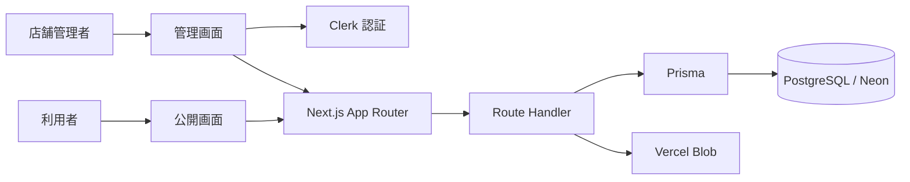

# ClearAllergy

架空店舗・架空メニューを使い、店舗が管理するアレルゲン情報を誤認されにくく提示するUI・情報設計を検証する、実運用前のプロトタイプです。

実際の飲食判断には使用しないでください。食品の安全性や摂取可否を判定・保証するものではありません。就職活動でのデモと、複数人による操作レビューを目的にしています。

## 概要

飲食店側は、管理画面から店舗情報・メニュー情報・画像・アレルゲン29品目の状態を登録できます。利用者側は、ログイン不要で公開店舗やメニューを閲覧し、各メニューに含まれる可能性のあるアレルゲン情報を確認できます。

公開画面と管理画面を分け、店舗管理者が自分の店舗データだけを更新できる構成にしています。

## 制作背景

自分自身に食物アレルギーの経験があり、外食時にアレルゲン情報を探す手間や、店員さんに確認する心理的な負担を感じていました。

一方で、飲食店側にとっても、紙のメニューや口頭説明だけで最新情報を伝え続けるのは負担が大きいと考えました。そこで、店舗側が情報を更新し、利用者側が事前に確認できる仕組みを Web アプリとして作成しました。

## 解決したい課題

- 利用者が、来店前や注文前にアレルゲン情報を確認しづらい
- 店舗側が、メニューごとのアレルゲン情報を継続的に更新・公開しづらい
- メニューの「含む」「含まない」だけでなく、「含む可能性」「未確認」も区別して伝える必要がある
- 公開情報と店舗管理情報を分け、安全に更新できる管理画面が必要

このアプリは医療的な判断を代替するものではなく、アレルゲン情報を確認しやすくするための補助ツールとして設計しています。

## 主な機能

### 利用者向け機能

- 公開中の店舗一覧の閲覧
- 店舗名・説明文による店舗検索
- 都道府県・市区町村・駅名・住所・カテゴリによるエリア検索
- 登録済み店舗だけを対象とした検索（公開画面の地図表示・外部店舗候補表示は未提供）
- 店舗ページでの公開メニュー一覧表示
- メニュー名・説明・カテゴリによるメニュー検索
- メニュー詳細での価格、カテゴリ、原材料、注意書きの確認
- アレルゲン29品目の状態表示
- 利用者自身の気になるアレルゲンを `localStorage` に保存し、公開画面で注意表示
- 店舗公開 URL の共有

### 店舗管理者向け機能

- Clerk を利用した管理者ログイン
- 店舗情報の登録・編集
- 店舗カテゴリ・エリア情報・Google店舗候補の登録
- 店舗画像のアップロード
- 店舗公開ページ用 QR コードの表示・印刷
- メニューの作成・編集・削除
- メニュー画像のアップロード
- メニュー画像・店舗画像の表示位置や拡大率の調整
- メニューの公開 / 非公開切り替え
- アレルゲン29品目ごとの状態登録
- 公開時にアレルゲン未設定項目が残っていないかサーバー側で確認
- 店舗管理者招待の作成・再送・取消
- 認証や管理操作の監査ログ記録
- ポートフォリオ公開用の閲覧専用モード

## 画面イメージ

| トップページ | メニュー詳細 | 店舗管理 |
| --- | --- | --- |
|  |  |  |

## 使用技術

| 分類 | 技術 |
| --- | --- |
| フロントエンド | Next.js App Router / React / TypeScript / Tailwind CSS |
| バックエンド / サーバーサイド | Next.js Route Handler / Server Component |
| データベース | PostgreSQL / Neon 想定 |
| ORM | Prisma |
| 認証 | Clerk |
| 画像保存 | Vercel Blob |
| デプロイ | Vercel |
| その他 | `qrcode.react` / Zod / ESLint |

## 技術選定理由

| 技術 | 選定理由 |
| --- | --- |
| Next.js App Router | 公開画面、管理画面、API Route、認証連携、DB アクセスを 1 つのコードベースで整理できるため |
| TypeScript | メニュー、店舗、アレルゲン状態などのデータ構造を型で扱い、実装時のミスを減らすため |
| Tailwind CSS | 公開画面と管理画面を素早く作りながら、表示状態ごとのスタイルを調整しやすいため |
| Prisma | DB スキーマとアプリケーション側の型を対応させ、マイグレーションとクエリを管理しやすいため |
| PostgreSQL / Neon | 店舗、メニュー、アレルゲン、招待、監査ログなどの関連データを扱いやすいため |
| Clerk | 認証・セッション管理を外部サービスに任せ、アプリ側では店舗権限の管理に集中するため |
| Vercel Blob | 店舗画像・メニュー画像をアプリ本体とは分けて保存し、Vercel 環境で扱いやすくするため |
| Vercel | Next.js アプリをデプロイしやすく、Neon や Blob との組み合わせを想定しやすいため |
| Google Places API | 管理者が店舗候補を入力する既存の補助機能。公開検索からは呼び出さない |

## システム構成



### 主な画面ルート

| ルート | 役割 |
| --- | --- |
| `/` | トップページ |
| `/shops` | 公開店舗一覧 |
| `/shops/[shopId]` | 公開店舗ページ |
| `/shops/[shopId]/menus/[menuId]` | 公開メニュー詳細 |
| `/terms` | 利用規約 |
| `/admin/login` | 管理ログイン |
| `/admin/register` | 店舗登録 / 初回セットアップ |
| `/admin/invitations` | 店舗管理者招待 |
| `/admin/menus` | メニュー一覧 |
| `/admin/menus/new` | メニュー新規作成 |
| `/admin/menus/[menuId]/edit` | メニュー編集 |
| `/admin/shop` | 店舗情報編集 |
| `/admin/demo` | ポートフォリオ用デモ管理画面 |

### 主な API Route / Route Handler

| ルート | 役割 |
| --- | --- |
| `/api/allergens` | アレルゲン29品目一覧 |
| `/api/menus/[menuId]` | 公開メニュー取得 |
| `/api/admin/register` | 旧自己登録API。現在は自己登録停止 |
| `/api/admin/onboarding` | Clerk ログイン後の初回店舗作成 |
| `/api/admin/auth/login` | 管理ログイン時の事前確認・監査ログ |
| `/api/admin/auth/sso` | Google / SSO 導線の監査ログ |
| `/api/admin/shop` | ログイン中店舗の取得・更新 |
| `/api/admin/menus` | ログイン中店舗のメニュー一覧・作成 |
| `/api/admin/menus/[menuId]` | ログイン中店舗のメニュー取得・更新・削除 |
| `/api/admin/upload-shop-image` | 店舗画像アップロード |
| `/api/admin/upload-menu-image` | メニュー画像アップロード |
| `/api/admin/invitations` | 店舗管理者招待の一覧・作成 |
| `/api/admin/invitations/[inviteId]/resend` | 招待再送 |
| `/api/admin/invitations/[inviteId]/revoke` | 招待取消 |
| `/api/invitations/accept` | 招待受諾 |

## ディレクトリ構成

```text
ClearAllergy/
├─ app/
│  ├─ (public)/               # 公開画面
│  ├─ admin/                  # 管理画面
│  ├─ api/                    # Route Handler
│  ├─ sign-in/                # Clerk サインイン導線
│  └─ sign-up/                # Clerk サインアップ導線
├─ features/                  # 機能別の画面・API・スキーマ
├─ components/                # 共通UI・レイアウト
├─ lib/
│  ├─ auth/                   # Clerk 連携
│  ├─ validators/             # 入力検証
│  ├─ auth/admin-auth.ts      # 管理画面の認証・店舗解決
│  ├─ storage/upload-images.ts # 画像アップロード検証
│  ├─ storage/image-url-policy.ts # 保存済み画像URLの検証
│  └─ allergens.ts            # アレルゲン共通ロジック
├─ prisma/
│  ├─ schema.prisma           # DB スキーマ
│  ├─ migrations/             # マイグレーション
│  └─ seed.ts                 # 初期データ
├─ document/                  # 説明資料・スクリーンショット
├─ docs/                      # 開発ルール・検証観点
├─ scripts/                   # 開発・移行用スクリプト
├─ proxy.ts                   # Clerk middleware
├─ package.json
└─ .env.example
```

※ このリポジトリでは `middleware.ts` ではなく、`proxy.ts` で Clerk の middleware を有効化しています。

## DB設計概要

主なモデルは以下です。

| モデル | 役割 |
| --- | --- |
| `User` | アプリ内ユーザー。`clerkUserId` で Clerk ユーザーと紐づける |
| `Shop` | 店舗情報。店舗名、説明、住所、営業時間、画像、公開状態などを持つ |
| `MenuItem` | メニュー情報。価格、カテゴリ、原材料、注意書き、画像、公開状態を持つ |
| `Allergen` | アレルゲン29品目のマスタ |
| `MenuItemAllergen` | メニューとアレルゲンの中間テーブル。状態を保持する |
| `AdminInvite` | 店舗管理者招待の状態管理 |
| `AuditLog` | 認証・招待・メニュー更新などの監査ログ |

### アレルゲン状態

`MenuItemAllergen.status` では、以下の 4 状態を扱います。

| 状態 | 表示上の意味 |
| --- | --- |
| `CONTAINS` | 含む |
| `FREE` | 原材料に含まない登録（食品安全の保証ではない） |
| `MAY_CONTAIN` | 含む可能性あり・要確認。コンタミだけを意味しない |
| `UNKNOWN` | 未設定 / 未確認 |

新規作成時や欠損時は `UNKNOWN` を基準にし、公開時には 29 品目が未設定のままにならないようサーバー側でも確認しています。

## 認証・権限管理

認証の正本は Clerk です。`proxy.ts` で Clerk middleware を通し、`lib/auth/getCurrentAppUser.ts` と `lib/auth/admin-auth.ts` で Clerk ユーザーとアプリ内の `User` / `Shop` を結びつけています。

管理画面では、ログイン中の Clerk ユーザー ID と `Shop.ownerClerkUserId` を照合し、認証済みユーザーの店舗データだけを取得・更新します。API 側でも `requireShopId()` を通して `shopId` を確定し、クライアントから渡された店舗 ID を信用しない設計にしています。

古いローカル認証用の `passwordHash` は、既存ユーザーを Clerk へ移行するための互換情報として残っています。現行のランタイム認証は Clerk を前提にしています。

## アレルゲン情報の扱い

アレルゲンは 29 品目をマスタデータとして保持し、各メニューに対して `CONTAINS` / `FREE` / `MAY_CONTAIN` / `UNKNOWN` の状態を登録します。

公開画面では、現行マスタの品目ごとの状態を表示します。分類別の強調表示は実装していません。利用者が選択した気になるアレルゲンは `localStorage` に保存し、端末内の設定として表示に反映します。

他の公開可能なメニューのCONTAINSは、公開登録から得た補足として一覧・詳細・APIに反映します。FREE自体は変更せず、実際の厨房の取扱いを確認した情報とは扱いません。公開前・原材料変更時はUIで確認を求めますが、APIの公開条件は従来どおりです。

## セットアップ方法

### 前提条件

- Node.js 22.23.1（ローカル検証済み。Next.jsの最低要件は20.9以上）
- PostgreSQL または Neon のデータベース
- Clerk アプリケーション
- 画像アップロードを確認する場合は Vercel Blob

### 1. 依存関係をインストール

```bash
npm install
```

### 2. 環境変数を作成

```bash
cp .env.example .env
```

PowerShell の場合:

```powershell
Copy-Item .env.example .env
```

### 3. Prisma Client を生成

```bash
npx prisma generate
```

### 4. 新規のデモ専用DBだけにマイグレーションを実行

```bash
npx prisma migrate dev
```

### 5. 初期データを投入

```bash
npm run seed
```

`seed` はデータの追加専用ではありません。既存アレルゲンマスタや同名デモメニューの更新・削除を行い、Clerk のキーがある場合はデモユーザーの外部同期も試みます。既存・共有DBや実データのあるDBには実行しないでください。既存・共有DBへのマイグレーションや、このseedの実行はしていません。保存の検証には、後述の独立テスト環境と専用の初期化スクリプトを使用します。

`/admin/demo` は専用ユーザー `demo@clearallergy.local` に属する店舗を表示します。店舗名の「デモ」文字列では判定しません。対象がなければ未準備の案内になります。匿名のデモ画面では入力しても保存されません。

保存・再読込・公開までの操作レビューには、別途デモ専用環境でClerkにログインでき、稼働店舗の `ownerClerkUserId` が一致する管理者が必要です。`PORTFOLIO_MODE=true` の場合は、さらにアプリ管理者ロールまたは編集許可の条件を満たす必要があります。自己登録の環境変数を `open` に変えても登録は開きません。専用アカウント・デモDBは、後述の `compose.test.yaml` と `scripts/setup-test-env.ts` で準備できます。

### 6. 開発サーバーを起動

```bash
npm run dev
```

起動後、ブラウザで [http://localhost:3000](http://localhost:3000) を開きます。

## 環境変数

`.env.example` を元に設定します。実際の値や秘密情報は README に記載しません。

| 変数名 | 必須 | 用途 |
| --- | --- | --- |
| `DATABASE_URL` | 必須 | Prisma / PostgreSQL 接続先 |
| `DIRECT_URL` | 必須 | Prisma Migrate 用の直接接続先 |
| `PORTFOLIO_MODE` | 任意 | ポートフォリオ公開時に一般ユーザーの更新を閲覧専用にする |
| `PORTFOLIO_EDITOR_APP_USER_IDS` | 任意 | `PORTFOLIO_MODE=true` でも更新を許可するアプリ内 `User.id`。カンマ区切り |
| `ADMIN_REGISTRATION_MODE` | 旧設定 | 現在はコードで常に `disabled`。値を変えても自己登録は開かない |
| `ADMIN_REGISTRATION_INVITE_TOKEN` | 旧設定 | 現在のClerk招待受諾フローでは使わない |
| `ENABLE_CLERK_ADMIN_AUTH` | 任意 | Google / Clerk SSO 導線の表示制御 |
| `NEXT_PUBLIC_CLERK_PUBLISHABLE_KEY` | 必須 | Clerk の公開キー |
| `CLERK_SECRET_KEY` | 必須 | Clerk のサーバー側キー |
| `NEXT_PUBLIC_APP_URL` | 任意 | QR コードや公開 URL 生成に使うベース URL |
| `NEXT_PUBLIC_GOOGLE_MAPS_API_KEY` | 旧画面用 | 公開画面は現在地図の案内表示のみ |
| `NEXT_PUBLIC_GOOGLE_MAPS_MAP_ID` | 旧画面用 | 公開画面では現在使わない |
| `GOOGLE_MAPS_SERVER_API_KEY` | 管理者の店舗候補検索時 | サーバー専用。公開 `/api/places/search` は常に利用不可応答 |
| `BLOB_READ_WRITE_TOKEN` | 画像アップロード時に必要 | Vercel Blob の読み書きトークン |
| `ALLOWED_IMAGE_URL_PREFIXES` | 任意 | 許可する自分のBlobストアのHTTPS URL prefix。未設定時はBlobトークンからストアを限定 |

ローカルで画像アップロードまで確認する場合は、`BLOB_READ_WRITE_TOKEN` も設定してください。

### GitHub Actions CI

`.github/workflows/ci.yml` は、`main` 向けの `pull_request` と `main` への `push` で以下を実行します。

```bash
npm ci
npx prisma generate
npm test
npm run lint
npm run typecheck
npm run build
```

CI では Vercel の Git 連携による Preview Deployment / Production Deployment を前提とし、独自の Vercel deploy や `prisma migrate deploy` は実行しません。

GitHub Secrets には、CI の `prisma generate` と `next build` に必要な以下の変数名だけを登録します。秘密情報の値は README に記載しません。

| Secret 名 | 用途 |
| --- | --- |
| `DATABASE_URL` | Prisma / PostgreSQL 接続先。CI用またはPreview用DBを推奨し、本番DBを直接使う場合は読み取りや実行内容に注意する |
| `DIRECT_URL` | Prisma schema の `directUrl` 用。CIでは migrate を実行しない |
| `NEXT_PUBLIC_CLERK_PUBLISHABLE_KEY` | Clerk の公開キー |
| `CLERK_SECRET_KEY` | Clerk のサーバー側キー |

`PORTFOLIO_MODE`、`ADMIN_REGISTRATION_MODE`、`ENABLE_CLERK_ADMIN_AUTH`、`NEXT_PUBLIC_APP_URL` は CI workflow 内で固定値を設定しています。`BLOB_READ_WRITE_TOKEN`、`GOOGLE_MAPS_SERVER_API_KEY`、Google Maps の公開キーは、現時点の CI build では必須にしていません。

## 動作確認方法

### 基本確認

```bash
npm test
npm run lint
npm run typecheck
npm run build
```

### 画面での確認例

1. `/shops` を開き、公開店舗一覧が表示されることを確認する
2. `/shops/[shopId]` で店舗情報と公開メニューが表示されることを確認する
3. `/shops/[shopId]/menus/[menuId]` でアレルゲン29品目、原材料、注意書きが表示されることを確認する
4. 公開画面で気になるアレルゲンを選び、再読み込み後も表示が維持されることを確認する
5. `/admin/login` から管理画面へ入り、`/admin/menus` と `/admin/shop` が表示できることを確認する
6. メニューを作成し、29品目の状態を入力して保存できることを確認する
7. 未設定のアレルゲンが残った状態で公開しようとすると、エラーになることを確認する
8. `BLOB_READ_WRITE_TOKEN` を設定した場合、店舗画像・メニュー画像をアップロードできることを確認する

### package.json の主なスクリプト

| コマンド | 用途 |
| --- | --- |
| `npm run dev` | 開発サーバー起動 |
| `npm run build` | 本番ビルド |
| `npm run start` | ビルド後の起動 |
| `npm run lint` | ESLint |
| `npm run typecheck` | TypeScript 型チェック |
| `npm run seed` | 初期データ投入 |
| `npm run auth:migrate:clerk` | 既存ユーザーの Clerk 移行 |
| `npm run auth:create:test-user` | テストユーザー作成 |
| `npm run repair:published-menus` | 公開メニュー整合性の補修 |

## 工夫した点

- 公開画面と管理画面を分け、利用者と店舗管理者の目的を分離した
- 店舗管理者は自分の店舗データだけを扱えるよう、Clerk のユーザー ID と DB の店舗所有者を照合している
- アレルゲンを単なる Boolean ではなく、`CONTAINS` / `FREE` / `MAY_CONTAIN` / `UNKNOWN` の 4 状態で扱った
- 公開時には 29 品目の未設定が残っていないか、UI だけでなくサーバー側でも確認している
- 画像は Vercel Blob に保存し、DB には URL と表示設定を保存する構成にした
- 保存済み画像 URL は、許可した Blob 由来の URL かどうかを表示時・保存時に確認している
- 管理系の更新 API では同一オリジン確認や監査ログ記録を入れている
- ポートフォリオ公開用に、一般ユーザーの更新を制限する閲覧専用モードを用意している

## 苦労した点・学んだこと

- 認証は Clerk、アプリ固有の権限は DB で管理するという役割分担を整理するのに苦労した
- メニューとアレルゲン29品目の関係を中間テーブルで扱い、画面上では常に 29 品目を欠けずに表示する設計を学んだ
- 「未設定」と「含まない」を分けないと、利用者に誤解を与える可能性があることに気づいた
- 画像アップロードでは、ファイル形式・サイズ・保存先 URL の検証が必要だと学んだ
- ポートフォリオとして見せるために、実運用機能とデモ表示のバランスを考える必要があった

## 今後の改善予定

- 店舗向けの入力補助や確認フローをさらに分かりやすくする
- アレルゲン情報の更新履歴を利用者にも分かりやすく表示する
- 店舗ごとの複数管理者運用をより実運用に近い形に整える
- 画像アップロード後の削除・差し替え管理を改善する
- E2E テストを追加し、公開画面と管理画面の主要導線を継続的に確認する
- 本番運用に向けて、エラーログ監視や問い合わせ導線を整備する
- スマートフォンでの閲覧性をさらに改善する

## 注意事項

- ClearAllergy はポートフォリオ用の個人開発プロジェクトです
- アレルゲン情報は確認を支援するための表示であり、医療的な判断を代替するものではありません
- 実際の利用では、店舗側の最新情報やスタッフへの確認も必要です
- `.env` や Clerk / DB / Blob の秘密情報はリポジトリに含めないでください
- デモデータは開発確認用であり、本番 DB へ投入しない想定です
- `ADMIN_REGISTRATION_MODE=open` は誰でも登録を試せるため、本番では `disabled` または `invite_only` を推奨します
- `PORTFOLIO_MODE=true` の場合、一般ユーザーの更新操作は閲覧専用として扱われます
- 画像アップロードを使うには `BLOB_READ_WRITE_TOKEN` が必要です
- 現行実装の認証は Clerk です

## 作者

Kaito Iwase
食物アレルギーの当事者としての経験をもとに、外食時の情報確認をしやすくすることを目指して制作しました。

## Dockerでの開発・検証

Docker DesktopのLinuxコンテナを使用します。WSLで作業する場合は、対象ディストリビューションのWSL integrationが必要です。Node.jsと依存ライブラリはコンテナ内で動作し、ホストのnode_modules・.nextとは別の名前付きボリュームを使います。

```bash
docker compose up --build -d
docker compose exec app npm test
docker compose exec app npm run lint
docker compose exec app npm run typecheck
```

ブラウザでは `http://localhost:3100` を開きます。ビルドを確認するときは開発サーバーを停止して実行します。

```bash
docker compose stop app
docker compose run --rm --no-deps app npm run build
docker compose up -d
```

`.env` と `.env.local` は実行時に読み込みます。Dockerイメージには含めません。Composeはアプリコンテナだけを起動し、DBの作成・初期化、migration、seed、Clerk設定変更を自動実行しません。既存のDB接続先はそのまま使用するため、操作レビューで実際に保存する前にデモ専用DBであることを確認してください。

## 保存・公開を試せる独立テスト環境

`compose.test.yaml` は、通常の開発環境とは別のPostgreSQL・ボリューム・ポートを使用します。アプリは `http://localhost:3101`、DBはCompose内部の `test-db/clearallergy_test` です。DBのポートはホストへ公開しません。既存の `.env` / `.env.local` のDB接続先は、テストCompose内だけで専用DBへ上書きします。

Clerkは既存の**開発用**キーを使用し、専用の管理者2アカウントを作成します。既存アカウントのパスワードや権限は変更しません。画像アップロードは既存のVercel Blob接続を使用し、テスト用店舗IDのパスへだけ新規保存します。DBは独立していますが、ClerkアプリとBlobストア自体を新規作成する構成ではありません。

```bash
docker compose -f compose.test.yaml build app
docker compose -f compose.test.yaml up -d test-db
docker compose -f compose.test.yaml run --rm --no-deps --user "$(id -u):$(id -g)" app node --import tsx scripts/setup-test-env.ts
docker compose -f compose.test.yaml up -d app
```

初期化スクリプトは、接続先が専用DBであることとClerkキーが開発用であることを確認してから、既存マイグレーションを適用します。架空のデモカフェ1件・管理者の店舗2件と、各店舗の架空メニュー3件を用意します。再実行時は既存のテストデータを上書きしません。

ログイン情報は `.clerk/clearallergy-test-accounts.json` に保存します。`accounts[0]` が店舗A、`accounts[1]` が店舗Bです。Git・Dockerイメージには含まれず、パスワードはログへ表示しません。このファイルを共有・コミットしないでください。メールアドレスにはClerk開発環境の `+clerk_test` 形式を使用し、実メール配送を抑止します。この開発用テストアカウントで確認コードを求められた場合は、Clerkのテストコード `424242` を使用します。

- 管理者ログイン：`http://localhost:3101/admin/login`
- 保存しない管理デモ：`http://localhost:3101/admin/demo`
- 公開側：`http://localhost:3101/shops`

```bash
docker compose -f compose.test.yaml exec app npm test
docker compose -f compose.test.yaml exec app npm run typecheck
docker compose -f compose.test.yaml exec app npm run lint
docker compose -f compose.test.yaml exec app node --import tsx scripts/check-test-database.ts
```

DB検証はその実行で作った架空店舗だけを片付けます。メニューの欠損・UNKNOWNによる自動非公開、MAY_CONTAINの公開維持、ロールバックを実際のPostgreSQLで確認します。

ブラウザ自動検証は既存のPlaywrightランナーを使う `scripts/check-test-browser.mjs` です。Playwrightを外部ランタイムから使う場合は `PLAYWRIGHT_MODULE_PATH`、Chromiumの場所を指定する場合は `BROWSER_EXECUTABLE` を設定して、ホストのNode.js 22で実行します。アプリにPlaywright依存を追加することは必須にしていません。

```bash
node scripts/check-test-browser.mjs
docker compose -f compose.test.yaml exec app node --import tsx scripts/cleanup-test-images.ts
```

このブラウザ検証は実際に専用店舗の説明を保存し、メニューを作成・公開・編集・削除し、Blobへ画像をアップロードします。メニューはテスト終了時に削除します。画像の片付けは記録ファイルにある今回のテスト画像だけが対象です。ClerkのTesting Tokenはbot検出対策に使い、管理APIの認証・店舗所有権確認はそのまま通します。

ビルドを再確認するときは、開発サーバーと `.next` が競合しないよう停止してから実行します。

```bash
docker compose -f compose.test.yaml stop app
docker compose -f compose.test.yaml run --rm --no-deps app npm run build
docker compose -f compose.test.yaml up -d app
```

依存更新後はイメージのビルドだけで既存の依存ボリュームが入れ替わるわけではありません。対象のComposeでアプリを停止し、`run --rm --no-deps app npm ci` と `run --rm --no-deps app npx prisma generate` を実行してから再起動してください。`down -v` はDBデータも消すため、通常の起動・停止では使いません。


## Prisma設定依存の限定更新

`@prisma/config@6.19.3` が使う `deepmerge-ts` に対してだけ、`package.json` の `overrides` で `8.0.0` を指定しています。Prisma／Prisma Clientは6.19.3のままです。循環参照の結合でスタック上限超過になる [GHSA-ggr8-5vv4-36mx](https://github.com/advisories/GHSA-ggr8-5vv4-36mx) に対応するためで、監査対象から除外しているわけではありません。

8.0.0にはMapの結合動作などの変更があるため、Prisma側が元々指定していた範囲を越える更新として検証しています。`tests/prisma-config-compat.test.ts` はPrismaから解決される実際の依存を使い、循環参照入力、型付き設定の読込・相対パス・migration設定、設定なし・不正設定の扱いを確認します。修正前は循環参照テストが失敗し、修正後は成功することを確認しました。

2026-09-06時点で、Dockerのテスト・型チェック・lint・Prisma検証／生成・専用DBの整合性／トランザクション・ビルドと、`npm audit`／`npm audit --omit=dev` の0件を確認しています。実運用の安全性を保証するものではありません。

Prismaが修正版の依存を正式に取り込んだ際に限定指定の解除を検討します。Prisma更新時には依存ツリーとauditを確認し、上記の回帰テストとDB・ビルド検証を再実行してください。解除が必要になった場合は限定overrideだけを削除してlockfileを再生成できますが、上流が未修正なら脆弱性が再び残ります。`npm audit fix --force` は使用していません。
