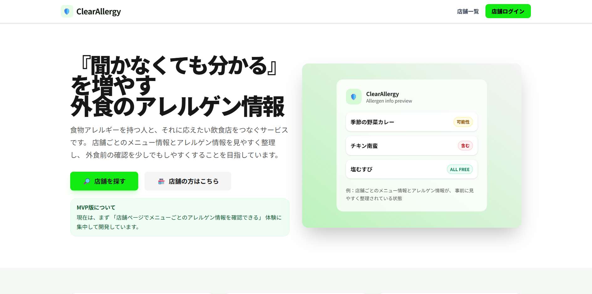
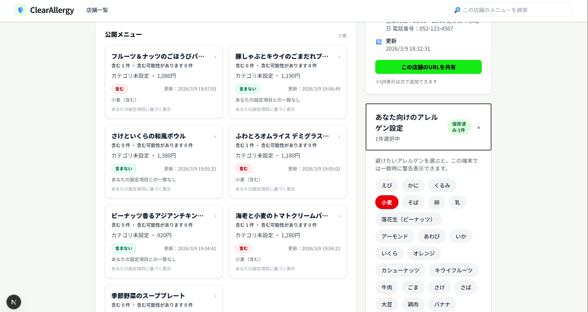
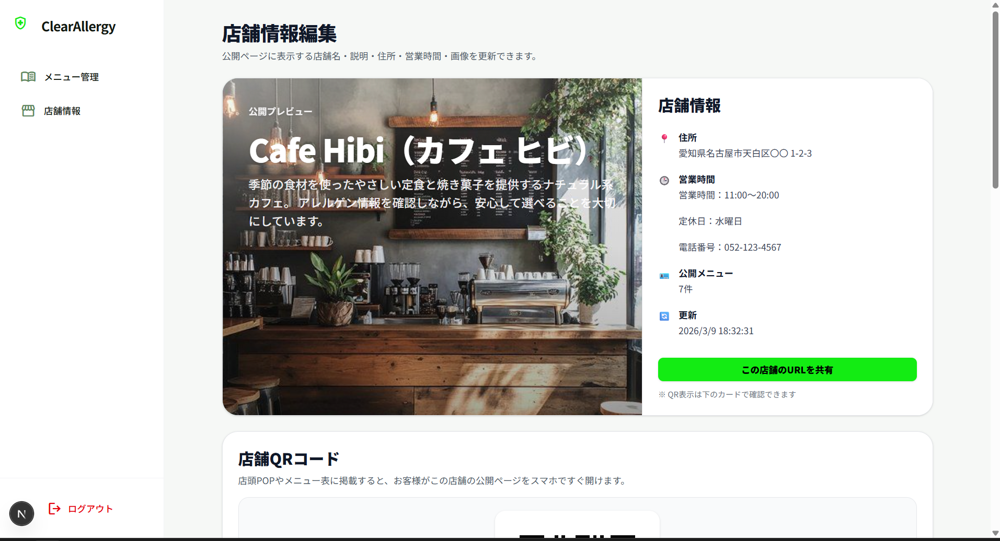

# ClearAllergy

飲食店が食物アレルゲン情報を登録・公開できる Web アプリです。  
来店者はスマートフォンから店舗ページやメニュー詳細ページを開き、アレルゲン情報を確認できます。

## 概要

外食時にアレルゲン情報がわかりづらいという課題に対して、  
**店舗側が情報を登録・更新できること** と、  
**利用者側が見やすく確認できること** を両立することを目的に開発しています。

このアプリでは以下を想定しています。

- 店舗側：ログインして店舗情報・メニュー情報を管理する
- 利用者側：公開ページからメニューとアレルゲン情報を確認する
- 個別設定：利用者が気になるアレルゲンを選択し、警告表示を受ける
- 店頭導線：QRコードから店舗公開ページへ誘導する

## 主な機能

### 店舗側（管理画面）

- ログイン
- 店舗情報の編集
- 店舗画像アップロード
- メニュー一覧表示
- メニュー新規作成（下書き作成 → edit 画面へ遷移）
- メニュー編集
- アレルゲン 28 品目の状態設定
    - 含む
    - 含まない
    - 含む可能性があります
- 公開 / 非公開の切り替え
- 価格設定
- 店舗公開URLの共有
- 店舗QRコード表示

### 利用者側（公開画面）

- 店舗ページ表示
- メニュー一覧表示
- メニュー詳細表示
- 特定原材料8品目の見やすい表示
- 28品目一覧表示
- localStorage を使った個人アレルゲン設定
- 選択アレルゲンに応じた警告表示
- 「含まない」項目の表示

## 技術スタック

- Next.js (App Router)
- TypeScript
- Tailwind CSS
- Prisma
- PostgreSQL
- NextAuth
- Vercel Blob

## ルーティング構成

### 公開側

- `app/(public)`

### 管理側

- `app/admin/(auth)`
- `app/admin/(dashboard)`

## データ設計のポイント

- `Shop`
- `MenuItem`
- `Allergen`
- `MenuItemAllergen`

の構成で、メニューとアレルゲンは中間テーブルで関連付けています。  
アレルゲン状態は次の 3 値で管理しています。

- `CONTAINS`
- `FREE`
- `MAY_CONTAIN`

## 工夫した点

### 1. 管理APIと公開APIを分離

公開側は閲覧中心、管理側はログイン済み店舗のみ更新可能という責務分離を行っています。

### 2. 28品目マスタを DB で管理

アレルゲン一覧を固定データではなくマスタ管理し、表示順も `sortOrder` で制御しています。

### 3. 新規メニュー作成の導線

`/new` ページを増やさず、  
**「新規作成 → 先に下書きをDBに作る → edit 画面へ移動」**  
という導線にして、編集UIを1本化しています。

### 4. 利用者側の個別アレルゲン設定

ログインなしでも使えるように、利用者のアレルゲン設定は localStorage で保持しています。

### 5. 店頭利用を意識した QR 導線

店舗URLを QRコード化し、店頭POPやメニュー表から公開ページへ誘導できるようにしています。

## 今後の改善予定

- 公開側の価格表示の改善
- 管理画面で編集できる項目の拡充
- 印刷しやすい QR カードの作成
- 画像まわりのUX改善
- エラーメッセージの整理
- テスト追加
- README / スクリーンショット整備

## 画面イメージ





## セットアップ

### 1. 依存関係をインストール

```bash
npm install
```
