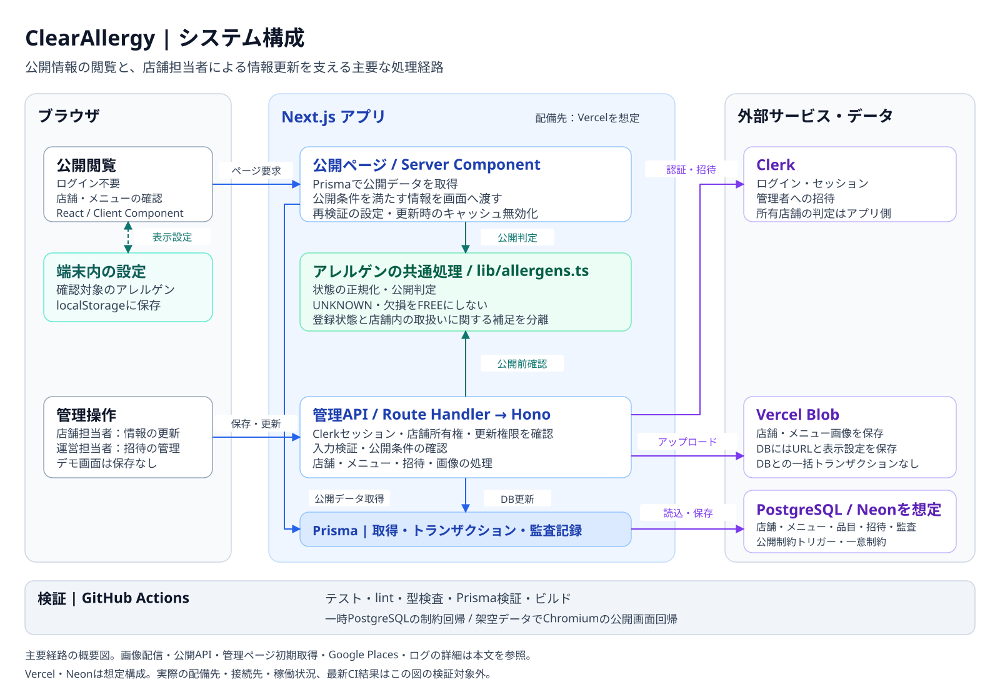

# ClearAllergy

**店舗が更新するアレルゲン情報を、外食前に確認できるWebアプリ。**

店舗担当者によるアレルゲン情報の登録・更新と、利用者による情報確認を支援します。現在は架空店舗・架空メニューを使い、就職活動でのデモと操作レビューを通じて価値と課題を検証する、実運用前のプロトタイプです。

実際の飲食判断には使用しないでください。食品の安全性や摂取可否を判定・保証するものではありません。

[主な機能](#features) · [設計上の工夫](#design) · [システム構成](#architecture) · [デモ・起動](#demo) · [開発ドキュメント](#reading-order)

## 制作背景

自分自身に食物アレルギーの経験があり、外食時にアレルゲン情報を探す手間や、店員さんに確認する心理的な負担を感じていました。

飲食店側にとっても、紙のメニューや口頭説明だけで最新情報を伝え続けるのは負担が大きいと考えました。そこで、**店舗が情報を更新し、利用者が来店前に確認できる流れ**をWebアプリとして形にしました。

設計では、情報が足りない状態を「含まない」と扱わず、登録内容と確認が必要な点を区別して伝えることを重視しています。制作の出発点は作者の経験であり、店舗・利用者への調査によって需要が実証された段階ではありません。

<a id="features"></a>
## 誰が何をするアプリか

| 対象 | 主な機能 |
| --- | --- |
| 利用者 | ログインせずに登録店舗を検索。エリア・最寄り駅・キーワードなどで絞り込み、メニューの原材料・注意書き・アレルゲン情報を確認 |
| 利用者 | 確認対象のアレルゲンをブラウザに保存し、一覧・詳細の表示に反映。位置情報を許可した場合は店舗を距離順に表示 |
| 店舗担当者 | 招待・ログインを経て、自店舗の基本情報、メニュー、画像、品目別の状態を登録・更新。公開条件を満たすメニューを公開 |
| 店舗担当者 | 店舗ページのURLを共有するQRコードを表示・印刷 |
| 運営担当者 | 店舗管理者の招待を作成・再送・取消。店舗担当者とは別の権限で管理 |

利用者のアレルゲン設定は端末内の `localStorage` に保存します。アカウントへの保存や端末間の同期は行いません。操作・画面ごとの説明は[操作とページ](docs/guide/product.md)を参照してください。

<a id="design"></a>
## 設計上の工夫

| 課題 | 実装で取り組んだこと | 確認できるコード・仕様 |
| --- | --- | --- |
| 情報の不足が「含まない」に見えることを防ぐ | 保存状態を4状態で扱い、未入力・欠損を `UNKNOWN` に正規化。公開条件をUI・API・DBトリガーで確認し、登録状態と店舗内の取扱いに関する補足を分離 | [共通ルール](docs/guide/rules.md#allergens)、[公開条件](docs/guide/rules.md#publication)、[lib/allergens.ts](lib/allergens.ts) |
| ログインした担当者が他店舗のデータを操作することを防ぐ | Clerkで本人を確認した後、サーバー側で所有店舗を解決。メニューの取得・更新・削除をリソースIDと店舗IDで限定 | [権限の境界](docs/guide/rules.md#ownership)、[adminMenuRoute.ts](features/admin/menus/server/adminMenuRoute.ts) |
| メニューと品目別情報の保存が途中で食い違うことを防ぐ | 関連レコードをトランザクションで更新。招待受諾では行ロックと一意制約を利用。画像ストレージとの整合性は別の課題として扱う | [保存処理](docs/guide/architecture.md#mutation)、[招待処理](docs/guide/architecture.md#invitations)、[DB定義](prisma/schema.prisma) |
| 古い入力や以前の確認が食品変更後も使われることを防ぐ | 版付き保存で競合を拒否。根拠・範囲・日時と当時の食品内容を記録し、食品変更後は再確認まで停止。記録の存在は実食品の正確性を証明しない | [食品確認と公開条件](docs/guide/rules.md#publication)、[移行と検証](docs/guide/development.md#食品確認記録の移行と検証) |
| 閲覧と入力で必要な処理を分ける | 公開ページはServer Componentでデータを取得し、検索・端末設定・入力などをClient Componentで処理。管理操作はAPIで検証して保存 | [内部処理](docs/guide/architecture.md)、[PublicMenuDetailPage.tsx](features/public/shops/server/PublicMenuDetailPage.tsx) |
| 障害の原因を追いながら、内部情報の露出を抑える | APIに要求IDを付け、処理時間と固定したエラー分類を記録。業務監査と運用ログを分け、利用者には一般的なエラーと再試行を表示 | [要求と障害の追跡](docs/guide/architecture.md#observability)、[lib/observability.ts](lib/observability.ts) |

これらは現行実装の説明です。食品の安全性、実環境での完全な防御、利用者への効果が検証済みであることを示すものではありません。設計の理由やトレードオフを説明する練習には[面接用Q&A](docs/interview/design-decisions.md)を用意しています。

<a id="architecture"></a>
## システム構成



[図を拡大する](docs/guide/diagrams/clearallergy-architecture.svg) · [draw.io編集用ファイル](docs/guide/diagrams/clearallergy-architecture.drawio)

公開ページの初期表示では、Server ComponentがPrismaを通じてDBから取得します。管理画面の保存はNext.js Route Handlerを入口とし、Honoの処理で認証・所有権・入力・公開条件を確認してからDBを更新します。画像はサーバー経由でVercel Blobへアップロードし、DBにはURLと表示設定を保存します。

図は主要な閲覧・更新経路を示しています。公開メニューAPI、管理ページの初期データ取得、管理画面のGoogle Places店舗候補検索などの詳細は[内部処理](docs/guide/architecture.md#system-diagram)と[変更対応表](docs/guide/change-map.md)を参照してください。Vercel・Neonは配備先として想定する構成で、実際の接続先・設定・稼働状況は別途確認が必要です。

### 使用技術と役割

| 分野 | 技術 | このアプリでの役割 |
| --- | --- | --- |
| 画面・サーバー | Next.js App Router / React / TypeScript | 公開・管理ページ、サーバーでのデータ取得、ブラウザの操作UI |
| スタイル | Tailwind CSS | レスポンシブ表示、入力・読込・エラーなどの状態表現 |
| API・入力検証 | Next.js Route Handlers / Hono / Zod | 管理操作の窓口、リクエスト処理、入力検証 |
| データ | Prisma / PostgreSQL | 店舗・メニュー・品目別状態・招待・監査の保存、関連データの整合性 |
| 認証 | Clerk | ログイン、セッション、管理者への招待。店舗の操作権限はアプリ側で確認 |
| 画像 | Vercel Blob | 店舗・メニュー画像の保存 |
| 開発・検証 | Node.js / Docker Compose / GitHub Actions | ローカル起動、専用DBの検証環境、変更時の自動検査 |

依存バージョンは[package.json](package.json)と[package-lock.json](package-lock.json)、技術の役割と既存の選定記録は[内部処理](docs/guide/architecture.md)にまとめています。

<a id="demo"></a>
## デモ・起動

起動後は、次の順に操作すると公開側と管理側の流れを確認できます。

1. `/shops` で店舗を検索し、店舗ページからメニュー詳細へ進む。
2. 利用者設定で確認対象を選び、一覧・詳細への反映を見る。
3. `/admin/demo` で店舗情報、`/admin/demo/menus` でメニューの管理画面を確認する。
4. 管理デモの新規作成・編集画面で入力を試す。**デモの操作はDB・画像ストレージへ保存されません。**

### 既存のWindows開発環境で起動する

PowerShellで、依存・Prisma Clientと許可された開発用接続先が準備済みであることを確認してから実行します。

```powershell
Set-Location 'C:\Users\kaito\Documents\Github\ClearAllergy'
npm.cmd run dev
```

起動ログのURL（通常 `http://localhost:3000`）を開きます。新規セットアップ、環境変数、Docker、保存を試す専用テスト環境は[開発手順](docs/guide/development.md#environment)を参照してください。通常のDocker構成はアプリだけを起動し、DBを自動作成しません。通常管理画面での保存には、自店舗の所有関係と更新権限を持つアカウントが必要です。

## 検証の仕組みと現在の課題

自動テストでは、アレルゲンの状態・公開条件、入力検証、APIの認証・所有権、招待の競合、ログの情報制限などを検査します。APIの単体テストは外部サービス等をモックに置き換え、実DB・実ブラウザの確認とは分けています。

[CI定義](.github/workflows/ci.yml)には、テスト・lint・型検査・Prisma検証・ビルドに加え、一時PostgreSQLでの制約・ロールバック検査と、架空データを使ったChromiumの公開画面回帰を組み込んでいます。[依存監査](.github/workflows/dependency-audit.yml)は対象の変更PR・週次・手動で実行する構成です。これらは検証方法の説明であり、最新のCI実行結果を示すものではありません。

| 検証・改善したい点 | 現在の境界 |
| --- | --- |
| 利用者・店舗担当者による操作レビュー | 情報の理解しやすさ、確認対象の設定、店舗側の入力負担、継続利用の価値は検証課題 |
| 実認証・外部サービス・配備環境 | 公開画面のCI回帰は実Clerk認証・Blob書込を含まない。実環境の認可、画像容量、キャッシュ反映は別途確認 |
| 同時編集と複数担当者の運用 | トランザクションだけでは古いフォームによる上書きを防げない。現行の店舗所有者モデルと併せて改善方針を検討 |
| 運用と画像の後処理 | 未参照画像の回収、監視通知、問い合わせ導線、監査記録の保持方針が残課題 |

詳細は[確認範囲・不一致・未確認事項](docs/guide/verification.md#issues)を参照してください。改善候補を実装済みの機能や承認済みの計画として扱わないようにしています。

<a id="reading-order"></a>
## 開発ドキュメント

初めて読む場合は、以下の順に進むと操作から内部処理、変更時の確認まで追えます。

| 順番 | 文書 | 分かること |
| --- | --- | --- |
| 1 | [操作とページ](docs/guide/product.md) | 利用者・店舗の操作、表示、失敗時の挙動 |
| 2 | [状態・公開・権限](docs/guide/rules.md) | アレルゲンの意味、公開条件、店舗ごとの権限 |
| 3 | [操作から保存・表示まで](docs/guide/architecture.md) | 構成図、画面・API・DBの処理とコードの役割 |
| 4 | [起動・確認・変更の進め方](docs/guide/development.md) | Windows・Docker、環境の選択、検証・運用コマンド |
| 5 | [変更対応表](docs/guide/change-map.md) | ページ・機能から仕様、実装、API、DB、テストを探す入口 |
| 6 | [文書の保守](docs/guide/maintenance.md) | 変更に伴う文書更新と完了条件 |

開発者・AIエージェントは、変更前に[AGENTS.md](AGENTS.md)、[変更対応表](docs/guide/change-map.md)、関連仕様を読み、呼び出し元も検索して影響範囲を確認します。

自律開発を依頼する場合は[Issue中心の自律開発](docs/agentic-development.md)を参照してください。ローカル検証ハーネスと独立レビュー、GitHub上の検証、公開反映の許可を区別して進めます。

安全性・情報の根拠・設計の再評価は[研究資料](docs/research/README.md)にまとめています。現行実装の観察、未承認の設計案、検証計画を区別しており、現行仕様の正本は上記ガイドです。

## 作者

Kaito Iwase

食物アレルギーの当事者としての経験をもとに、外食時の情報確認をしやすくすることを目指して制作しています。
