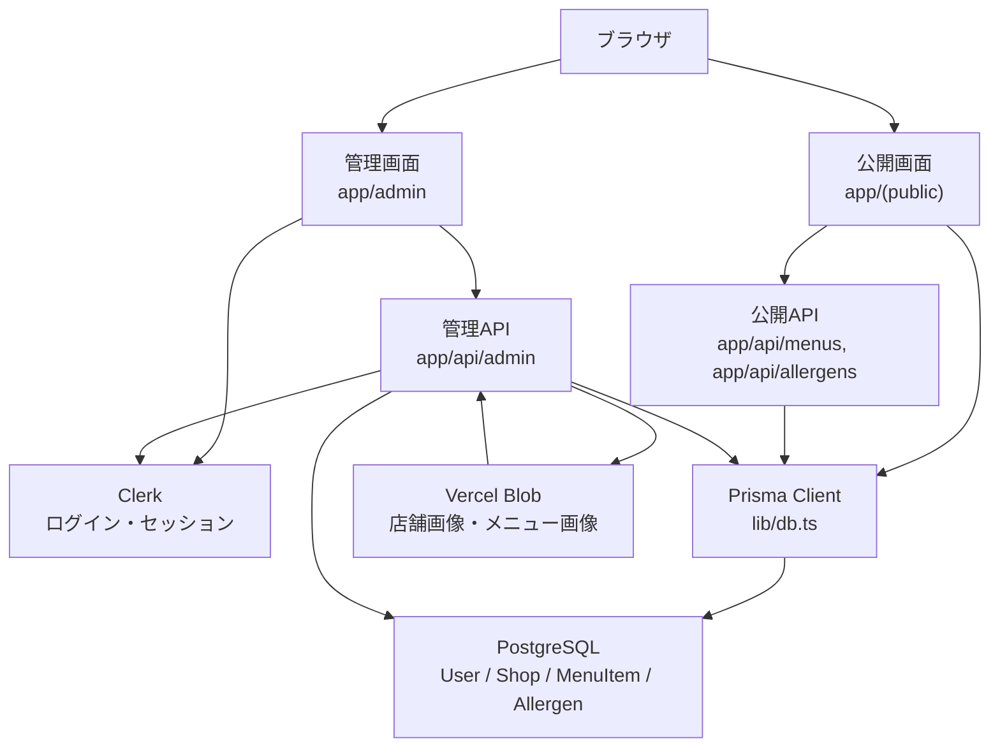
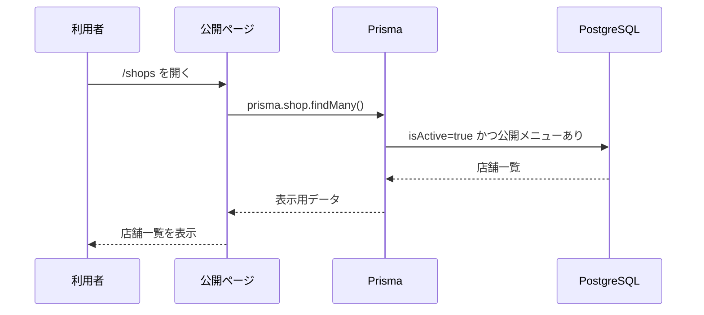
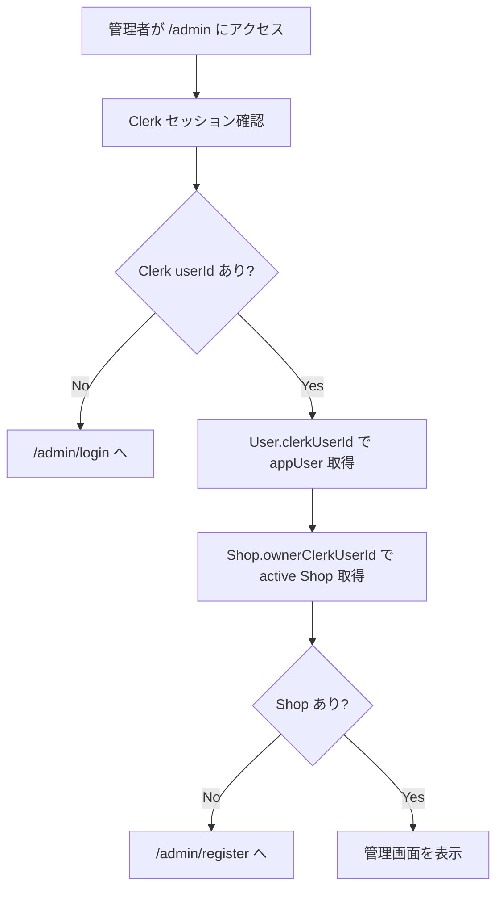
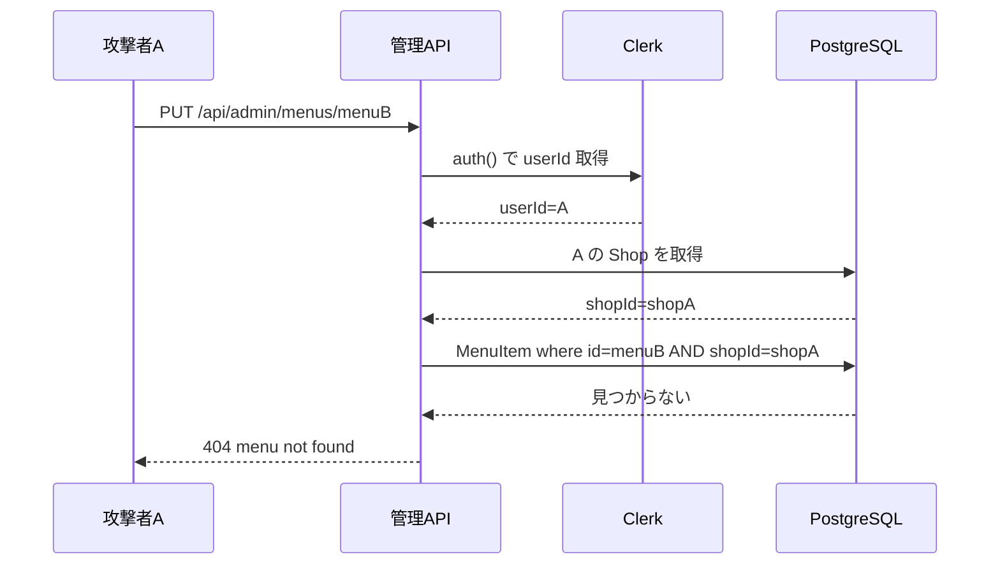
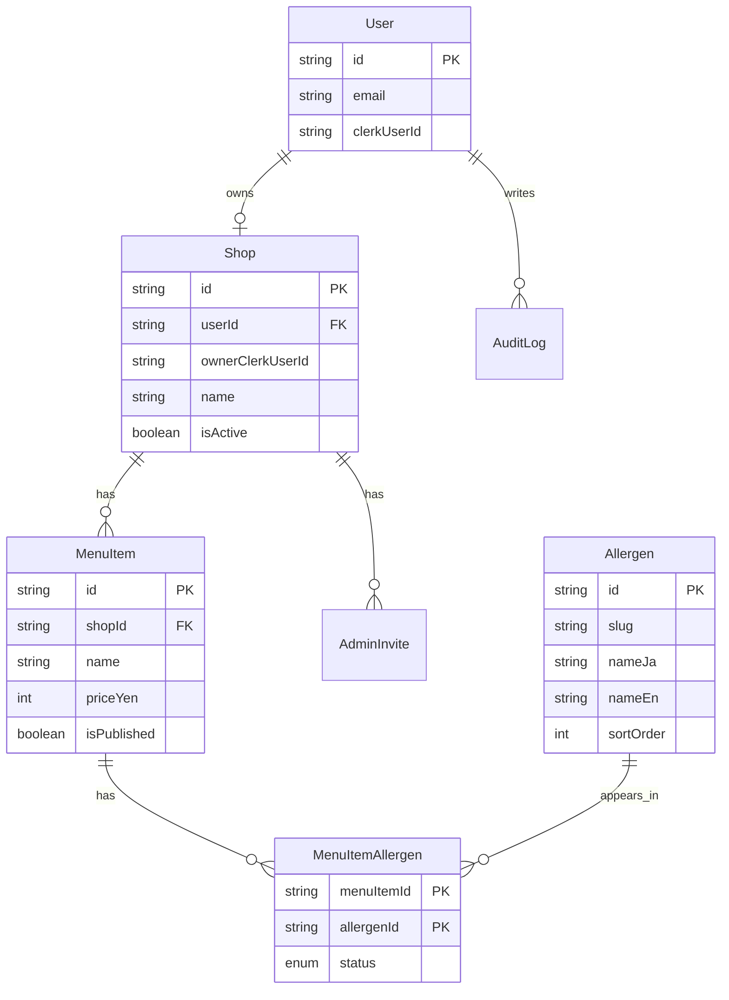
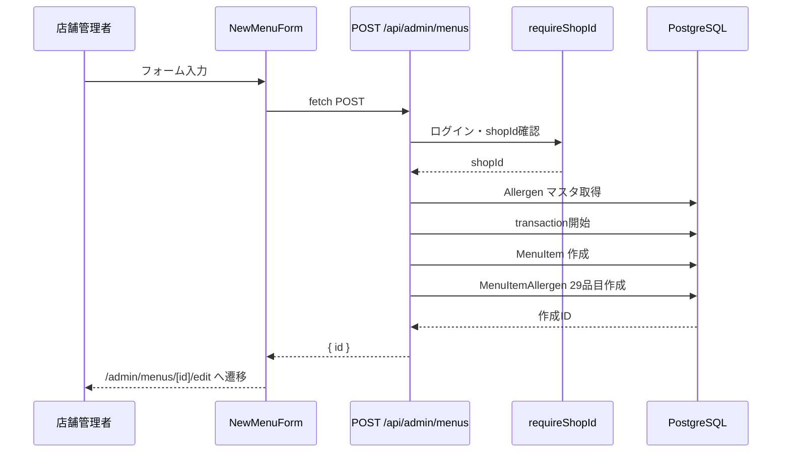
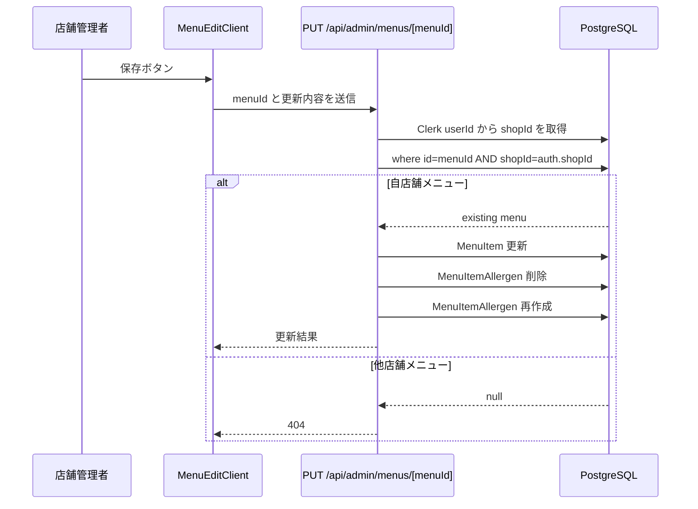
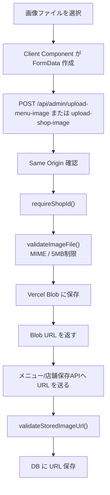

# ClearAllergy 図解システム理解ガイド

## 0. このドキュメントの目的

このドキュメントは、ClearAllergy の全体構造を「図で先に理解する」ための資料です。

文章だけで読むと分かりにくい次の関係を、ASCII 図、Mermaid 図、表で整理します。

- 公開画面と管理画面の分かれ方
- 画面、API、認証、DB のつながり
- Clerk userId から shopId を決める流れ
- MenuItem、Allergen、MenuItemAllergen の DB 関係
- 画像アップロードと Vercel Blob の関係
- 他店舗データ更新を防ぐ認可の考え方

現在の正しい前提は Clerk 認証です。古い NextAuth 前提の説明が残っていても、この資料では Clerk を正として扱います。

## 1. 全体構成図

ClearAllergy は、同じ Next.js プロジェクトの中に「公開側」と「管理側」があります。

```txt
利用者のブラウザ
  ↓
公開画面 app/(public)
  ↓
公開ページの Server Component
  ↓
Prisma
  ↓
PostgreSQL

店舗管理者のブラウザ
  ↓
管理画面 app/admin
  ↓
Clerk でログイン確認
  ↓
管理API app/api/admin
  ↓
Prisma
  ↓
PostgreSQL
```

画像アップロードを含めると、全体像は次のようになります。



簡単に言うと、公開側は「見るだけ」、管理側は「ログインして更新する」です。

## 2. 主要技術の役割マップ

| 技術 | このプロジェクトでの役割 | 主なファイル |
| --- | --- | --- |
| Next.js App Router | URL、画面、API を作る土台 | `app/` |
| TypeScript | 型付きで安全に実装する | `.ts`, `.tsx` |
| React | 画面をコンポーネントで作る | `components/` |
| Server Component | サーバー側で DB 取得や認証確認をする | `app/(public)/**/page.tsx`, `app/admin/(dashboard)/**/page.tsx` |
| Client Component | 入力、クリック、状態管理、fetch をする | `components/admin/**/*.tsx`, `components/public/**/*.tsx` |
| Clerk | ログイン状態と userId を管理する | `app/admin/layout.tsx`, `proxy.ts`, `lib/auth/getCurrentAppUser.ts` |
| Prisma | TypeScript から DB を操作する ORM | `lib/db.ts`, `prisma/schema.prisma` |
| PostgreSQL | アプリのデータを保存する DB | `User`, `Shop`, `MenuItem`, `Allergen` |
| Vercel Blob | 画像ファイル本体を保存する | `lib/upload-images.ts` |
| Tailwind CSS | 画面の見た目を作る | `app/globals.css`, className |

## 3. URL とファイルの対応図

```txt
app/
├─ page.tsx                              -> /
├─ (public)/
│  ├─ shops/page.tsx                     -> /shops
│  ├─ shops/[shopId]/page.tsx            -> /shops/:shopId
│  └─ shops/[shopId]/menus/[menuId]/page.tsx
│                                         -> /shops/:shopId/menus/:menuId
├─ admin/
│  ├─ layout.tsx                         -> /admin 配下を ClerkProvider で包む
│  ├─ (auth)/login/page.tsx              -> /admin/login
│  ├─ (auth)/register/page.tsx           -> /admin/register
│  └─ (dashboard)/
│     ├─ layout.tsx                      -> 管理画面の認証ガード
│     ├─ shop/page.tsx                   -> /admin/shop
│     ├─ menus/page.tsx                  -> /admin/menus
│     ├─ menus/new/page.tsx              -> /admin/menus/new
│     └─ menus/[menuId]/edit/page.tsx    -> /admin/menus/:menuId/edit
└─ api/
   ├─ allergens/route.ts                 -> /api/allergens
   ├─ menus/[menuId]/route.ts            -> /api/menus/:menuId
   └─ admin/
      ├─ shop/route.ts                   -> /api/admin/shop
      ├─ menus/route.ts                  -> /api/admin/menus
      ├─ menus/[menuId]/route.ts         -> /api/admin/menus/:menuId
      ├─ upload-shop-image/route.ts      -> /api/admin/upload-shop-image
      └─ upload-menu-image/route.ts      -> /api/admin/upload-menu-image
```

`(public)` や `(dashboard)` は Route Group です。Route Group とは、URL には出さずにフォルダを整理するための仕組みです。

## 4. 公開側のデータ取得フロー

公開側はログイン不要です。ただし、公開してよいデータだけを取得します。



店舗詳細では、`Shop` と公開済み `MenuItem` を一緒に取得します。

```txt
/shops/[shopId]
  ↓
app/(public)/shops/[shopId]/page.tsx
  ↓
prisma.shop.findFirst({
  where: {
    id: shopId,
    isActive: true,
    menus: { some: { isPublished: true } }
  }
})
  ↓
店舗情報 + 公開メニュー一覧
```

メニュー詳細では、`shopId` と `menuId` と `isPublished` を同時に確認します。

```txt
/shops/[shopId]/menus/[menuId]
  ↓
prisma.menuItem.findFirst({
  where: {
    id: menuId,
    shopId,
    isPublished: true
  }
})
  ↓
MenuItem + MenuItemAllergen + Allergen
  ↓
アレルゲン29品目を表示
```

## 5. 管理側の認証・認可フロー

認証とは、誰がログインしているか確認することです。

認可とは、その人がその操作をしてよいか確認することです。

ClearAllergy の管理側では、Clerk で認証し、DB の Shop 所有関係で認可します。



管理 API では `app/api/admin/_utils.ts` の `requireShopId()` が共通の入口です。

```txt
管理API
  ↓
requireShopId()
  ↓
getCurrentAdminContext()
  ↓
Clerk auth() から userId
  ↓
User.clerkUserId で appUser
  ↓
Shop.ownerClerkUserId で shop
  ↓
auth.shopId を API 内で使う
```

重要なのは、`shopId` をリクエスト body から信じないことです。

```txt
悪い設計:
  body.shopId を使って更新
  → 攻撃者が他店舗 shopId に書き換えられる

良い設計:
  Clerk userId からサーバー側で shopId を決める
  → body を書き換えても他店舗には届かない
```

## 6. IDOR 対策の図解

IDOR とは「他人のIDを指定するだけで他人のデータを見たり変更できてしまう問題」です。

悪い例です。

```txt
PUT /api/admin/menus/menuB
body: { shopId: "shopB", name: "改ざん" }

サーバー:
  body.shopId を信用
  ↓
  shopB の menuB を更新
  ↓
  他店舗データを更新できてしまう
```

ClearAllergy の良い例です。

```txt
PUT /api/admin/menus/menuB
body: { name: "改ざん" }

サーバー:
  Clerk userId から shopA を取得
  ↓
  where: { id: "menuB", shopId: "shopA" }
  ↓
  見つからない
  ↓
  404
  ↓
  更新されない
```

Mermaid で見ると次の流れです。



## 7. DBリレーション図

Prisma schema の主要モデルは次の関係です。



一番重要なのは、`MenuItem` と `Allergen` を直接つながず、`MenuItemAllergen` でつなぐことです。

```txt
MenuItem
  ├─ 米粉パンケーキ
  └─ 豆乳ベジカレー

Allergen
  ├─ egg
  ├─ milk
  └─ wheat

MenuItemAllergen
  ├─ 米粉パンケーキ x egg   = FREE
  ├─ 米粉パンケーキ x milk  = MAY_CONTAIN
  ├─ 豆乳ベジカレー x egg   = FREE
  └─ 豆乳ベジカレー x wheat = MAY_CONTAIN
```

## 8. アレルゲン状態の考え方

`MenuItemAllergen.status` は次の4値です。

| 値 | 表示 | 意味 |
| --- | --- | --- |
| `CONTAINS` | 含む | そのメニューに含まれる |
| `FREE` | 含まない | 含まれないと確認済み |
| `MAY_CONTAIN` | 含む可能性があります | 混入や同一厨房などの可能性あり |
| `UNKNOWN` | 未設定 | 未確認、未入力 |

`UNKNOWN` は「含まない」ではありません。

```txt
UNKNOWN
  ↓
まだ確認していない
  ↓
利用者に安全とは言えない
  ↓
公開時にはサーバー側で未設定を止める
```

`lib/allergens.ts` の `getMenuPublishValidationErrors()` は、公開時に未設定アレルゲンが残っていないか確認します。

## 9. メニュー作成フロー



ポイントは、`shopId` をフォームから送らないことです。

## 10. メニュー更新フロー



## 11. 店舗情報更新フロー

```txt
/admin/shop
  ↓
app/admin/(dashboard)/shop/page.tsx
  ↓
requireCurrentAdminContextOrRedirect()
  ↓
prisma.shop.findUnique({ where: { id: shopId } })
  ↓
ShopEditClient
  ↓
PUT /api/admin/shop
  ↓
requireShopId()
  ↓
prisma.shop.update({ where: { id: auth.shopId } })
  ↓
画面に保存結果を表示
```

店舗更新でも body の shopId は使いません。

## 12. 画像アップロードフロー



保存 path は店舗ごとに分かれます。

```txt
店舗画像:
  shops/{shopId}/cover-{timestamp}.{extension}

メニュー画像:
  menu-images/{shopId}/{timestamp}.{extension}
```

URL 保存時・表示時には `lib/image-url-policy.ts` で次を確認します。

- Vercel Blob の許可ホストか。
- path に対象 `shopId` が含まれるか。
- 店舗画像なら `shops/{shopId}/cover-` か。
- メニュー画像なら `menu-images/{shopId}/` か。

## 13. 公開APIと管理APIの違い

| 種類 | URL | ログイン | DB更新 | 主な条件 |
| --- | --- | --- | --- | --- |
| 公開API | `/api/allergens` | 不要 | なし | アレルゲン一覧を返す |
| 公開API | `/api/menus/[menuId]` | 不要 | なし | `isPublished: true` |
| 管理API | `/api/admin/shop` | 必要 | あり | `auth.shopId` |
| 管理API | `/api/admin/menus` | 必要 | POSTで作成 | `auth.shopId` |
| 管理API | `/api/admin/menus/[menuId]` | 必要 | PUT/DELETE | `id + auth.shopId` |
| 管理API | `/api/admin/upload-*` | 必要 | Blob保存 | `auth.shopId` |

公開 API は読めるだけです。管理 API は更新できるため、認証と認可が必須です。

## 14. 面接で図を使って説明するなら

短く説明するなら、次の図と言葉が中心です。

```txt
Clerk userId
  ↓
User.clerkUserId
  ↓
Shop.ownerClerkUserId
  ↓
shopId
  ↓
where: { id: menuId, shopId }
```

説明例です。

> 管理 API では、クライアントから shopId を受け取って信用しません。Clerk のログイン情報から userId を取得し、DB でその userId が所有する Shop を取得します。その shopId を使って `where: { id: menuId, shopId }` で更新対象を絞るため、他店舗の menuId を指定されても更新できません。

DB 設計の説明は次の図が中心です。

```txt
Shop 1 ── * MenuItem
MenuItem * ── * Allergen
          ↑
          MenuItemAllergen が status を持つ
```

説明例です。

> メニューとアレルゲンは多対多なので、中間テーブル MenuItemAllergen を置いています。ここに CONTAINS、FREE、MAY_CONTAIN、UNKNOWN の状態を保存することで、品目追加や表示順管理にも対応しやすくしています。
