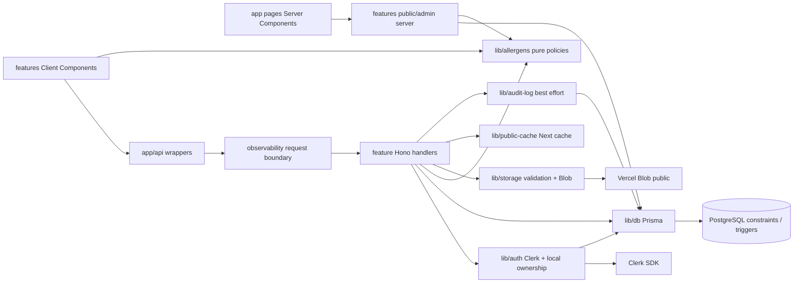
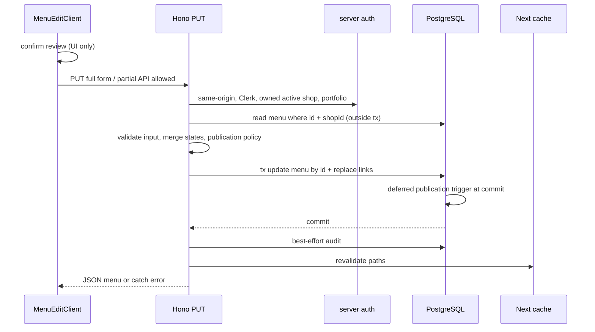
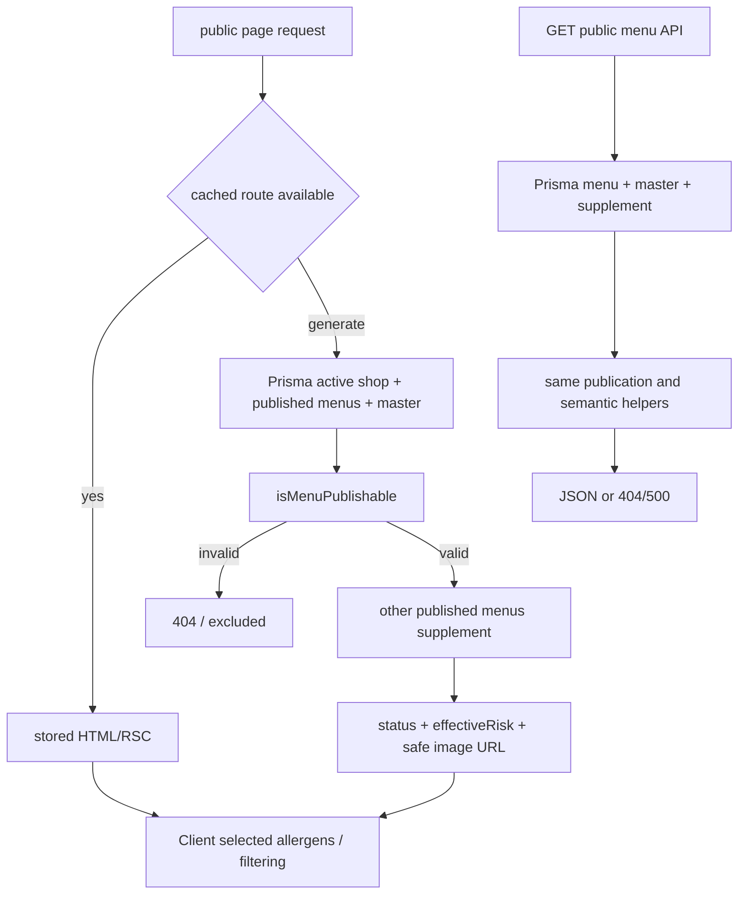
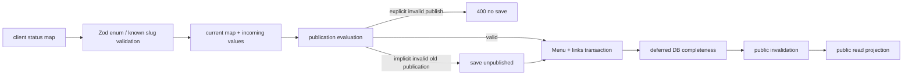

# Current architecture reconstructed

現行の入門説明は [guide/architecture](../../guide/architecture.md)。この図は研究snapshotの実dependency/control flowであり、target層を遡って当てはめたものではない。

Presentation: app wrappers、feature components、components/layout。Application logic: feature server route/pageに分散。Domain logic相当: lib/allergens、menu-update-helpers、publication-review、input schemas（DDD Entityではない）。Infrastructure: lib/db、storage、Clerk helpers、google-places。認証と所有権: lib/auth/admin-auth/platform-auth/API utilsとresource query。

## Main write flow

Main writeにはcreate/delete/shopもあり、[tx表](../engineering/transactions-concurrency.md)と[全mutation表](../engineering/authorization.md)に差異を示した。Server Actionは見つからない。

## Main read and publication flow

read側も公開条件を確認するが、既にcacheされたpayloadの内容を毎回DBで確認する構成ではない。Page→APIの内部HTTPではなく、両方がPrismaへ直接到達する。店補足も公開可能menuだけ。

## Allergen update flow

clientの全status送信とAPIの部分更新契約を区別。TX外のcurrent map読取、clientの古い全map、unknown enum fallback、reviewがUIのみ、が主な研究対象。
