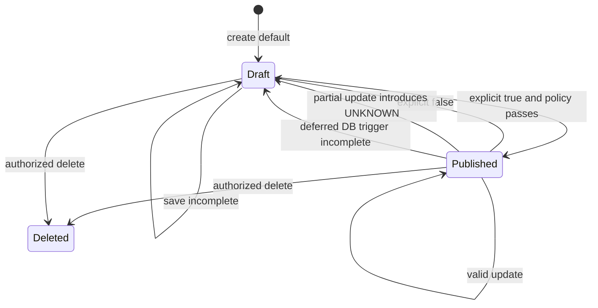

# Publication transitions and authority

現行条件は [rules](../../guide/rules.md#publication)。保存可能と公開可能を分離する。新たなenum state machineは現時点で不要。

明示true+不完全は400（保存しない）、省略+既存公開が不完全化は保存してfalse。SQL triggerはDB masterの完全性を守り、TypeScriptのcode master集合一致やshop activeをすべて代替するものではない。マスタが0でもDBのEXISTS条件だけでは完全性の意味が異なる。read-side gateは残す。

Target D01/D02ではbooleanを維持する。D03/D06を承認した場合だけrevision/reviewをpublication policyに追加。旧公開行を一括で“review済み”にbackfillしない。

文書相違HD-08: PublicShopDetailPageは公開可能menuが0件なら404。guide/rulesには0件表示があると書かれている。どちらが製品意図か不明で、研究では不一致を記録。現行codeを承認済み仕様に昇格させない。
