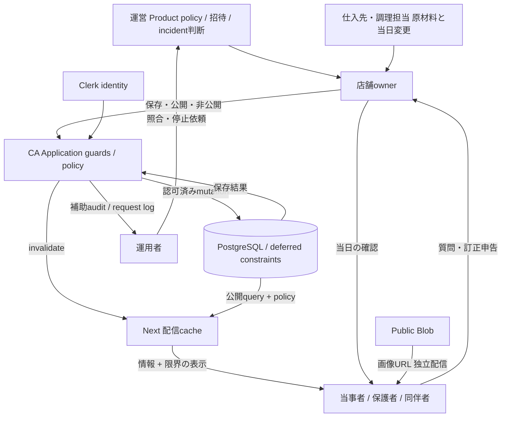

# Control structure and feedback

Controller: owner（入力/公開）、application（validation/auth/transaction）、DB（完全性）、運営（policy/incident）。Controlled process: 情報状態と公開投影。Feedback: 保存response、public read、audit/log、利用者からの申告。

欠けたfeedback: supplier→ownerの変更連動、レビューしたrevisionの記録、利用者がどの時点を閲覧したか、運用alert実配送、停止操作後のopen tab。追加event busより先に、人とシステムの責任・情報が到着する経路を定義する。

Trust boundaries: browser→server、Clerk→server、server→DB、server→Blob、DB→cache→browser、運用credential→DB。API認可とDB operator権限は独立。外部provider成功をDB transactionへ含めることはできない。
