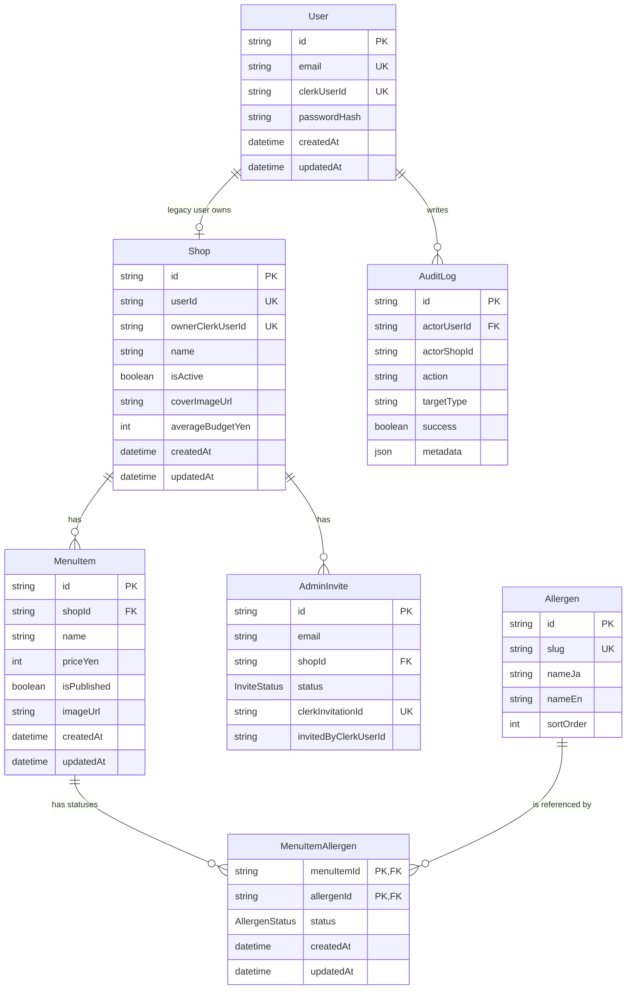

# ClearAllergy DB完全ガイド

作成日: 2026-04-27 JST

このドキュメントは、ClearAllergyのDB設計を `prisma/schema.prisma` から読み解き、Prisma、Next.js Route Handler、管理画面、公開画面、Clerk認証までつなげて理解するための教材です。

主に読んだファイル:

- `prisma/schema.prisma`
- `prisma/migrations/**/migration.sql`
- `prisma/seed.ts`
- `prisma/repair-published-menus.ts`
- `lib/db.ts`
- `lib/public-db.ts`
- `lib/allergens.ts`
- `lib/allergen-master.ts`
- `lib/admin-auth.ts`
- `lib/auth/getCurrentAppUser.ts`
- `lib/invitations.ts`
- `lib/audit-log.ts`
- `lib/validators/**`
- `app/api/admin/**/route.ts`
- `app/api/menus/[menuId]/route.ts`
- `app/api/allergens/route.ts`
- `app/admin/(dashboard)/**/page.tsx`
- `app/(public)/**/page.tsx`
- `components/admin/menu/**`
- `components/admin/shop/ShopEditClient.tsx`

## 1. このDB設計の全体像

ClearAllergyは、飲食店がメニューごとのアレルゲン情報を管理し、利用者が公開ページで確認できるWebアプリです。DBは「画面に表示する情報」と「管理者が更新する情報」を保存する場所です。

このアプリのDBが管理している主な情報は次の通りです。

| 種類 | 主なテーブル | 内容 |
| ---- | ---- | ---- |
| 店舗情報 | `Shop` | 店舗名、説明、住所、営業時間、定休日、電話番号、平均予算、カバー画像、公開有効状態 |
| メニュー情報 | `MenuItem` | メニュー名、説明、価格、カテゴリ、原材料、注意書き、画像、公開状態 |
| アレルゲン一覧 | `Allergen` | 29品目のマスタ。slug、日本語名、英語名、表示順 |
| メニューごとのアレルゲン状態 | `MenuItemAllergen` | あるメニューが、あるアレルゲンを「含む」「含まない」「含む可能性」「未確認」のどれとして扱うか |
| 管理者と店舗の紐付け | `User`, `Shop`, `AdminInvite` | ClerkユーザーIDとアプリ内ユーザー、店舗、招待を結び付ける |
| 監査ログ | `AuditLog` | 認証、メニュー更新、公開、削除、画像アップロードなどの管理操作の履歴 |

DBが必要な理由は、アプリを閉じても情報を残すためです。たとえば管理者が「米粉パンケーキは卵を含まないが大豆を含む」と入力した場合、その情報はブラウザの一時的な状態ではなく、DBに保存される必要があります。DBに保存されることで、別の日に管理画面を開いても同じ情報を編集でき、利用者も公開ページで最新の情報を確認できます。

ClearAllergyで特に重要なのは、メニューとアレルゲンを単純につなぐだけではなく、`MenuItemAllergen.status` として状態を保存している点です。アレルギー情報では「含まない」と「未確認」はまったく別の意味です。そのため、未確認を `FREE` と同じ扱いにしない設計が重要です。

## 2. ER図風の全体関係



1対1は、1つの行が別テーブルの1つの行と対応する関係です。このschemaでは `User.shop` と `Shop.user` が概念上1対1に近い関係です。`Shop.userId` に `@unique` があるため、1人のアプリ内ユーザーに複数店舗を直接持たせない設計になっています。ただし現在の実運用上の所有判定は、`Shop.ownerClerkUserId` を使うClerk前提に寄っています。

1対多は、1つの行が複数の行を持つ関係です。`Shop` と `MenuItem` は1対多です。1店舗は複数メニューを持てますが、1つのメニューは1つの店舗に属します。`MenuItem.shopId` がそのつながりです。

多対多は、両側が複数とつながる関係です。`MenuItem` と `Allergen` は多対多です。1つのメニューは複数のアレルゲン情報を持ち、1つのアレルゲン、たとえば「卵」は複数メニューで使われます。

`MenuItem` と `Allergen` を直接つなげず、`MenuItemAllergen` を使う理由は、関係そのものに追加情報が必要だからです。単なる「このメニューはこのアレルゲンと関係がある」だけでは足りません。「含む」「含まない」「含む可能性」「未確認」という状態を保存する必要があります。

そのため `MenuItemAllergen` はただの中間テーブルではありません。`status` を持つ、アプリの安全性に関わる重要テーブルです。特に `UNKNOWN` を保存できることで、未入力を安全そうに見せる事故を防ぎやすくなっています。

## 3. 各テーブルの役割を初心者向けに説明

### User

#### 役割

アプリ内のユーザーを保存するテーブルです。現在の認証の正本はClerkですが、アプリ側DBにも `User` を持ち、`clerkUserId` でClerkのユーザーと結び付けます。

#### 具体例

| id | email | clerkUserId | passwordHash |
| ---- | ---- | ---- | ---- |
| `cmabc...` | `owner@example.com` | `user_2abc...` | `null` |
| `cmdemo...` | `demo@clearallergy.local` | `user_demo...` | `$2b$...` |

#### 主なカラム

| カラム名 | 型 | 役割 | なぜ必要か |
| ---- | ---- | ---- | ---- |
| `id` | `String` | アプリ内Userの主キー | 他テーブルからUserを参照するため |
| `email` | `String?` | メールアドレス | 招待や管理者識別に使う |
| `passwordHash` | `String?` | 旧実装・seed互換用のパスワードハッシュ | Clerk移行前の互換情報として残っている |
| `clerkUserId` | `String?` | ClerkのユーザーID | Clerk認証とアプリDBを結び付ける |
| `createdAt` | `DateTime` | 作成日時 | いつ作られたかを追う |
| `updatedAt` | `DateTime` | 更新日時 | 最終更新を追う |

#### 他テーブルとの関係

- `User` 1件に対して `Shop` は最大1件です。`Shop.userId` が `User.id` を参照します。
- `User` 1件に対して `AuditLog` は複数件です。`AuditLog.actorUserId` が `User.id` を参照します。

#### このアプリ内で使われる場所

- `lib/auth/getCurrentAppUser.ts`: Clerkの `auth()` から得た `userId` を `User.clerkUserId` で検索します。
- `lib/admin-auth.ts`: `User` と所有店舗を読み、管理画面の文脈を作ります。
- `app/api/admin/register/route.ts`: 新規登録時にClerkユーザー作成後、アプリ内 `User` を作ります。ただし現在の登録モードは `lib/admin-registration.ts` で常に `disabled` です。
- `lib/invitations.ts`: 招待承認時に、Clerkユーザーに対応する `User` を作成または更新します。

### Shop

#### 役割

店舗情報を保存するテーブルです。公開ページに表示する店舗名、説明、住所、営業時間、カバー画像などを持ちます。また、ClerkユーザーIDによる店舗所有者情報も持ちます。

#### 具体例

| id | ownerClerkUserId | name | isActive | averageBudgetYen |
| ---- | ---- | ---- | ---- | ---- |
| `shop_001` | `user_2abc...` | `Cafe Hibi` | `true` | `1200` |

#### 主なカラム

| カラム名 | 型 | 役割 | なぜ必要か |
| ---- | ---- | ---- | ---- |
| `id` | `String` | 店舗の主キー | メニューや招待と紐付けるため |
| `userId` | `String?` | アプリ内Userへの外部キー | 旧来のUser-Shop関係と互換のため |
| `ownerClerkUserId` | `String?` | 現在の店舗所有者のClerk user id | 管理者が自店舗だけ操作できるようにするため |
| `name` | `String` | 店舗名 | 管理画面・公開画面の主表示 |
| `description` | `String?` | 店舗説明 | 公開ページの説明文 |
| `address` | `String?` | 住所 | 公開ページの店舗情報 |
| `hours` | `String?` | 営業時間 | 公開ページの店舗情報 |
| `regularHoliday` | `String?` | 定休日 | 営業情報を分けて表示するため |
| `phoneNumber` | `String?` | 電話番号 | 公開店舗情報 |
| `note` | `String?` | 備考 | 補足情報 |
| `isActive` | `Boolean` | 店舗が有効か | 招待承認前や未公開店舗を区別するため |
| `coverImageUrl` | `String?` | 店舗カバー画像URL | 公開ページの見た目に使う |
| `coverImageFrame` など | `String` / `Int` | 画像表示調整 | 画像の切り抜き、ズーム、位置を保存するため |
| `averageBudgetYen` | `Int?` | 平均予算 | 店舗一覧や詳細で予算目安を表示するため |
| `createdAt` / `updatedAt` | `DateTime` | 作成・更新日時 | 一覧の並び順や表示に使う |

#### 他テーブルとの関係

- `Shop` 1件は `MenuItem` を複数持ちます。
- `Shop` 1件は `AdminInvite` を複数持ちます。
- `Shop.userId` は `User.id` を参照します。`onDelete: SetNull` なので、Userが消えても店舗行は残り、`userId` が `null` になります。

#### このアプリ内で使われる場所

- `app/admin/(dashboard)/shop/page.tsx`: 店舗編集画面の初期表示。
- `app/api/admin/shop/route.ts`: 店舗情報の取得・更新API。
- `app/(public)/shops/page.tsx`: 公開店舗一覧。
- `app/(public)/shops/[shopId]/page.tsx`: 店舗詳細と公開メニュー一覧。
- `lib/admin-auth.ts`: `ownerClerkUserId` と `isActive` で管理者の所有店舗を決めます。
- `lib/invitations.ts`: 招待承認時に `ownerClerkUserId` と `isActive` を設定します。

### AdminInvite

#### 役割

店舗管理者をClerk招待で追加するためのテーブルです。Clerk側の招待IDと、ローカルDB側の招待状態を対応させます。

#### 具体例

| id | email | shopId | status | clerkInvitationId |
| ---- | ---- | ---- | ---- | ---- |
| `invite_001` | `owner@example.com` | `shop_001` | `pending` | `inv_abc...` |
| `invite_002` | `old@example.com` | `shop_002` | `revoked` | `inv_old...` |

#### 主なカラム

| カラム名 | 型 | 役割 | なぜ必要か |
| ---- | ---- | ---- | ---- |
| `id` | `String` | 招待の主キー | 招待の再送・取消で指定するため |
| `email` | `String` | 招待先メール | 誰を招待したかを管理するため |
| `shopId` | `String` | 招待対象店舗 | どの店舗の管理者にするかを表す |
| `status` | `InviteStatus` | 招待状態 | pending/accepted/revoked/expired/failedを区別するため |
| `clerkInvitationId` | `String?` | Clerk側の招待ID | Clerkの招待取消・再送と連携するため |
| `expiresAt` | `DateTime?` | 有効期限 | 古い招待を無効化するため |
| `invitedByClerkUserId` | `String` | 招待を作った運営者 | 誰が招待したか追うため |
| `acceptedByClerkUserId` | `String?` | 承認したClerkユーザー | どのClerkユーザーに紐付いたか追うため |

#### 他テーブルとの関係

- `AdminInvite.shopId` は `Shop.id` を参照します。
- `onDelete: Cascade` なので、店舗が削除されると、その店舗の招待も削除されます。

#### このアプリ内で使われる場所

- `app/api/admin/invitations/route.ts`: 招待一覧、招待作成。
- `app/api/admin/invitations/[inviteId]/revoke/route.ts`: 招待取消。
- `app/api/admin/invitations/[inviteId]/resend/route.ts`: 招待再送。
- `app/api/invitations/accept/route.ts`: 招待承認。
- `lib/invitations.ts`: 招待承認、期限切れ処理、シリアライズ。

### AuditLog

#### 役割

管理画面で重要な操作が行われたときの履歴を保存するテーブルです。「誰が」「どの店舗で」「何を」「成功したか」を後から確認できます。

#### 具体例

| id | actorUserId | actorShopId | action | targetType | success |
| ---- | ---- | ---- | ---- | ---- | ---- |
| `log_001` | `user_001` | `shop_001` | `menu_publish` | `menu` | `true` |
| `log_002` | `user_001` | `shop_001` | `shop_update` | `shop` | `false` |

#### 主なカラム

| カラム名 | 型 | 役割 | なぜ必要か |
| ---- | ---- | ---- | ---- |
| `id` | `String` | 監査ログの主キー | ログを一意に識別するため |
| `actorUserId` | `String?` | 操作したアプリ内User | 誰が操作したか追うため |
| `actorShopId` | `String?` | 操作対象の店舗 | 店舗単位でログを追うため |
| `action` | `String` | 操作種別 | menu_create, menu_updateなどを区別するため |
| `targetType` | `String` | 対象種別 | menu/shop/auth/image_uploadなどを区別するため |
| `targetId` | `String?` | 対象ID | どのメニューや店舗か追うため |
| `success` | `Boolean` | 成功したか | 失敗操作も調査できるようにするため |
| `ipAddress` | `String?` | IPアドレス | 不審操作の調査材料 |
| `metadata` | `Json?` | 補足情報 | 変更理由やエラー理由などを柔軟に保存するため |
| `createdAt` | `DateTime` | ログ作成日時 | 時系列で追うため |

#### 他テーブルとの関係

- `actorUserId` は `User.id` を参照します。
- `onDelete: SetNull` なので、Userが消えてもログ自体は残ります。

#### このアプリ内で使われる場所

- `lib/audit-log.ts`: `writeAdminAuditLog()` でログを書きます。
- `app/api/admin/menus/route.ts`: メニュー作成ログ。
- `app/api/admin/menus/[menuId]/route.ts`: 更新、公開、非公開、削除ログ。
- `app/api/admin/shop/route.ts`: 店舗更新ログ。
- `app/api/admin/register/route.ts`、`app/api/admin/onboarding/route.ts`: 認証・登録系ログ。

### MenuItem

#### 役割

店舗のメニューを保存するテーブルです。メニュー名、説明、価格、カテゴリ、原材料、注意書き、画像、公開状態を持ちます。

#### 具体例

| id | shopId | name | priceYen | category | isPublished |
| ---- | ---- | ---- | ---- | ---- | ---- |
| `menu_001` | `shop_001` | `米粉パンケーキ` | `980` | `デザート` | `true` |
| `menu_002` | `shop_001` | `豆乳ベジカレー` | `1280` | `メイン` | `false` |

#### 主なカラム

| カラム名 | 型 | 役割 | なぜ必要か |
| ---- | ---- | ---- | ---- |
| `id` | `String` | メニューの主キー | 編集・公開URL・中間テーブル参照に使う |
| `shopId` | `String` | 所属店舗ID | 他店舗データを混ぜないため |
| `name` | `String` | メニュー名 | 一覧・詳細の主表示 |
| `description` | `String?` | 説明 | 公開詳細の説明文 |
| `priceYen` | `Int?` | 価格 | 円単位の価格表示 |
| `category` | `String?` | カテゴリ | 検索・分類表示 |
| `ingredients` | `String?` | 原材料 | 利用者が確認する重要情報 |
| `precaution` | `String?` | 注意書き | コンタミなどの注意を表示するため |
| `imageUrl` | `String?` | メニュー画像URL | 公開・管理画面の画像表示 |
| `imageFrame` など | `String` / `Int` | 画像表示調整 | 画像の形、表示位置、ズームを保存するため |
| `isPublished` | `Boolean` | 公開中か | 下書きを公開ページに出さないため |
| `createdAt` / `updatedAt` | `DateTime` | 作成・更新日時 | 並び順や更新表示に使う |

#### 他テーブルとの関係

- `MenuItem.shopId` は `Shop.id` を参照します。
- `MenuItem` 1件は `MenuItemAllergen` を複数持ちます。
- `Shop` が削除されると `MenuItem` も `onDelete: Cascade` で削除されます。

#### このアプリ内で使われる場所

- `app/admin/(dashboard)/menus/page.tsx`: 管理メニュー一覧。
- `app/admin/(dashboard)/menus/new/page.tsx`: 新規メニュー画面のマスタ取得。
- `app/admin/(dashboard)/menus/[menuId]/edit/page.tsx`: 編集画面の初期データ取得。
- `app/api/admin/menus/route.ts`: 一覧取得と新規作成。
- `app/api/admin/menus/[menuId]/route.ts`: 1件取得、更新、削除。
- `app/(public)/shops/[shopId]/page.tsx`: 公開店舗ページのメニュー一覧。
- `app/(public)/shops/[shopId]/menus/[menuId]/page.tsx`: 公開メニュー詳細。
- `app/api/menus/[menuId]/route.ts`: 公開メニュー詳細API。

### Allergen

#### 役割

アレルゲンのマスタテーブルです。ここには「卵」「乳」「小麦」などの品目そのものを保存します。各メニューの状態はここには保存せず、`MenuItemAllergen` に保存します。

#### 具体例

| id | slug | nameJa | nameEn | sortOrder |
| ---- | ---- | ---- | ---- | ---- |
| `allergen_egg` | `egg` | `卵` | `Egg` | `6` |
| `allergen_pistachio` | `pistachio` | `ピスタチオ` | `Pistachio` | `29` |

#### 主なカラム

| カラム名 | 型 | 役割 | なぜ必要か |
| ---- | ---- | ---- | ---- |
| `id` | `String` | アレルゲンの主キー | 中間テーブルから参照するため |
| `slug` | `String` | 固定キー | APIや画面で安定して扱うため |
| `nameJa` | `String` | 日本語名 | 公開・管理画面で表示するため |
| `nameEn` | `String` | 英語名 | 管理画面などで補助表示するため |
| `sortOrder` | `Int` | 表示順 | 29品目を毎回同じ順番で出すため |
| `createdAt` / `updatedAt` | `DateTime` | 作成・更新日時 | マスタ更新を追うため |

#### 他テーブルとの関係

- `Allergen` 1件は `MenuItemAllergen` を複数持ちます。
- `Allergen.slug` は `@unique` なので同じslugは重複できません。

#### このアプリ内で使われる場所

- `lib/allergen-master.ts`: 29品目の定義。
- `prisma/seed.ts`: `upsert` でマスタを投入。
- `app/api/allergens/route.ts`: アレルゲン一覧API。
- 管理メニュー画面・公開メニュー画面全般。

### MenuItemAllergen

#### 役割

メニューとアレルゲンの関係を保存するテーブルです。さらに、その関係の状態である `status` を保存します。このアプリのアレルゲン管理の中核です。

#### 具体例

| menuItemId | allergenId | status |
| ---- | ---- | ---- |
| `menu_001` | `allergen_egg` | `FREE` |
| `menu_001` | `allergen_soybean` | `CONTAINS` |
| `menu_001` | `allergen_shrimp` | `MAY_CONTAIN` |
| `menu_001` | `allergen_pistachio` | `UNKNOWN` |

#### 主なカラム

| カラム名 | 型 | 役割 | なぜ必要か |
| ---- | ---- | ---- | ---- |
| `menuItemId` | `String` | メニューID | どのメニューの状態か示す |
| `allergenId` | `String` | アレルゲンID | どのアレルゲンの状態か示す |
| `status` | `AllergenStatus` | 状態 | 含む/含まない/可能性/未確認を区別する |
| `createdAt` / `updatedAt` | `DateTime` | 作成・更新日時 | 状態の作成・更新を追うため |

#### 他テーブルとの関係

- `menuItemId` は `MenuItem.id` を参照します。
- `allergenId` は `Allergen.id` を参照します。
- `@@id([menuItemId, allergenId])` により、同じメニューと同じアレルゲンの組み合わせは1行だけです。

#### このアプリ内で使われる場所

- `app/api/admin/menus/route.ts`: 新規作成時に全アレルゲン分を `createMany` で作成。
- `app/api/admin/menus/[menuId]/route.ts`: 更新時に一度 `deleteMany` してから `createMany` で再作成。
- `app/admin/(dashboard)/menus/[menuId]/edit/page.tsx`: 編集画面の初期値。
- `app/(public)/shops/[shopId]/page.tsx`: 公開一覧で利用者のアレルゲン設定と突き合わせる。
- `app/(public)/shops/[shopId]/menus/[menuId]/page.tsx`: 公開詳細で29品目を表示。
- `lib/allergens.ts`: 欠損している状態を `UNKNOWN` として正規化。

## 4. Prisma schema の読み方

`prisma/schema.prisma` は、Prismaに「DBにはどのテーブルがあり、どんなカラムがあり、どのテーブル同士が関係しているか」を伝える中心ファイルです。

### generator と datasource

```prisma
generator client {
  provider = "prisma-client-js"
}
```

`generator client` は、TypeScriptからDBを操作するためのPrisma Clientを生成する設定です。`provider = "prisma-client-js"` は、JavaScript/TypeScript用のクライアントを作るという意味です。

```prisma
datasource db {
  provider  = "postgresql"
  url       = env("DATABASE_URL")
  directUrl = env("DIRECT_URL")
}
```

`datasource` は接続先DBの設定です。このリポジトリではPostgreSQLを使っています。`env("DATABASE_URL")` は `.env` の環境変数から接続文字列を読むという意味です。`directUrl` はPrisma Migrateなど、直接接続が必要な場面で使うURLです。

### modelとは何か

`model` はDBのテーブルに対応します。

```prisma
model MenuItem {
  id     String @id @default(cuid())
  shopId String
  name   String
}
```

これは「MenuItemというテーブルがあり、id、shopId、nameというカラムを持つ」と読めます。

### id、@id、@default(cuid())

```prisma
id String @id @default(cuid())
```

`id` は1行を一意に識別する値です。主キーとも呼びます。`@id` は「このカラムが主キーです」という指定です。`@default(cuid())` は、新しい行を作るときにPrismaが自動でCUID形式のIDを作るという指定です。このschemaでは `@default(uuid())` は使われていません。

### @unique

```prisma
email       String? @unique
clerkUserId String? @unique
```

`@unique` は「同じ値を2行に入れられない」という制約です。メールアドレスやClerk user idが重複すると、どのユーザーか判別できなくなるため必要です。`String?` の `?` はnullable、つまり `null` を許すという意味です。

### @relation

```prisma
shop Shop @relation(fields: [shopId], references: [id], onDelete: Cascade)
```

`@relation` はテーブル同士の関係を表します。この例では、`MenuItem.shopId` が `Shop.id` を参照します。`onDelete: Cascade` は、親の `Shop` が削除されたら、その店舗の `MenuItem` も削除されるという意味です。

### @@id

```prisma
@@id([menuItemId, allergenId])
```

`@@id` は複数カラムを組み合わせた主キーです。`MenuItemAllergen` では、`menuItemId` と `allergenId` の組み合わせで1行を一意にします。これにより、同じメニューに対して同じアレルゲン状態が重複して保存されることを防げます。

### @@index

```prisma
@@index([shopId])
@@index([allergenId])
@@index([action, createdAt])
```

`@@index` は検索を速くするための索引です。たとえば `MenuItem` は `where: { shopId }` でよく検索されるため、`shopId` にindexがあります。`AuditLog` は `action` と `createdAt` で調べる可能性があるため、複合indexがあります。

### enum

```prisma
enum AllergenStatus {
  CONTAINS
  FREE
  MAY_CONTAIN
  UNKNOWN
}
```

`enum` は、入れられる値を決められた選択肢に限定する型です。`AllergenStatus` にはこの4つ以外を入れられません。文字列の自由入力にすると `contains`、`CONTAIN`、`含む` など表記ゆれが起きるため、enumで固定します。

### 型の意味

| Prisma型 | 意味 | このschemaでの例 |
| ---- | ---- | ---- |
| `String` | 文字列 | `name`, `email`, `slug` |
| `Int` | 整数 | `priceYen`, `sortOrder`, `imageZoom` |
| `Boolean` | 真偽値 | `isPublished`, `isActive`, `success` |
| `DateTime` | 日時 | `createdAt`, `updatedAt` |
| `Json` | JSON形式の柔軟なデータ | `AuditLog.metadata` |
| `AllergenStatus` | enum型 | `MenuItemAllergen.status` |
| `InviteStatus` | enum型 | `AdminInvite.status` |

### nullable、つまり `?`

```prisma
description String?
priceYen    Int?
```

`?` が付いているフィールドは `null` を許します。たとえば価格未入力なら `priceYen` は `null` です。空文字 `""` と `null` は違います。このアプリでは `lib/validators/admin-input.ts` の `toTrimmedNullableString()` で、空文字を `null` に寄せています。

## 5. ClearAllergyの中核リレーションを詳しく解説

### Shop と MenuItem

1店舗が複数メニューを持つのは自然な設計です。カフェであれば、パンケーキ、カレー、ドリンクなど複数のメニューがあります。そのため `Shop` から見て `MenuItem` は複数です。

`MenuItem` 側に `shopId` がある理由は、各メニューがどの店舗に属するかを明確にするためです。DBでは「子テーブル側に親のIDを持つ」形がよく使われます。ここでは `MenuItem` が子、`Shop` が親です。

セキュリティ上も `shopId` は重要です。管理画面の編集ページ `app/admin/(dashboard)/menus/[menuId]/edit/page.tsx` では、次のように `id` だけでなく `shopId` も条件に入れています。

```ts
const menu = await prisma.menuItem.findFirst({
    where: { id: menuId, shopId },
    select: {
        id: true,
        shopId: true,
        name: true,
        allergenLinks: {
            select: {
                status: true,
                allergen: { select: { slug: true } },
            },
        },
    },
});
```

これにより、他店舗の `menuId` をURLに直接入れても取得できません。管理API `app/api/admin/menus/[menuId]/route.ts` のGET、PUT、DELETEでも同じ考え方で `where: { id: menuId, shopId: auth.shopId }` を使っています。

### MenuItem と Allergen と MenuItemAllergen

`MenuItem` と `Allergen` は多対多です。

- 1つのメニューは、卵、乳、小麦、大豆など複数のアレルゲン状態を持つ
- 1つのアレルゲン、たとえば卵は、複数メニューで使われる

もし `MenuItem` に `eggStatus`, `milkStatus`, `wheatStatus` のようなカラムを直接増やすと、新しい品目が増えるたびにテーブル構造を変える必要があります。また、表示順や英語名も扱いづらくなります。

そのため `Allergen` をマスタとして持ち、`MenuItemAllergen` でメニューごとの状態を保存します。このテーブルは、Prismaの暗黙的な多対多では表せません。なぜなら `status` という追加カラムがあるからです。Prismaの暗黙的な多対多は「AとBがつながっている」だけを表す用途に向きますが、このアプリでは「AとBがどの状態でつながっているか」が必要です。

### User / Clerk / Shop の関係

現在の実装では、認証の正本はClerkです。

- `app/layout.tsx` で `ClerkProvider` を使う
- `proxy.ts` で `clerkMiddleware()` を使う
- `lib/auth/getCurrentAppUser.ts` で `auth()` と `currentUser()` を使う
- 管理画面やAPIでは `lib/admin-auth.ts` がClerk user idからアプリ内UserとShopを解決する

古いNextAuth前提の説明は、現在の正ではありません。このリポジトリ上では、NextAuthのセッションではなくClerkの `auth()` から得た `userId` を使います。

現在の所有判定で中心になるのは `Shop.ownerClerkUserId` です。`lib/admin-auth.ts` の `getCurrentAdminContext()` では、`clerkAppUser.clerkUserId` を使って次の条件で店舗を探します。

```ts
const activeOwnedShop = clerkAppUser.clerkUserId
    ? await prisma.shop.findFirst({
          where: {
              ownerClerkUserId: clerkAppUser.clerkUserId,
              isActive: true,
          },
      })
    : null;
```

招待承認の現在の主要導線では、`lib/invitations.ts` の `acceptPendingInviteForCurrentUser()` が `Shop` を次のように更新します。

```ts
const updatedShop = await tx.shop.update({
    where: { id: shop.id },
    data: {
        userId: appUser.id,
        ownerClerkUserId: args.clerkUserId,
        isActive: true,
    },
    select: {
        id: true,
        name: true,
        isActive: true,
    },
});
```

このため、現在の正しい店舗所有の軸は `ownerClerkUserId` と `isActive` です。`User.shop` や `Shop.userId` は残っていますが、Clerk移行後の互換・補助的な役割も含んでいます。

なお、`app/api/admin/register/route.ts` と `app/api/admin/onboarding/route.ts` には、`Shop` 作成時に `ownerClerkUserId` と `isActive` を設定しないコードが残っています。ただし `lib/admin-registration.ts` は自己登録を常に `disabled` にしており、現在の招待中心の運用とは前提が違います。この点は改善候補です。

## 6. AllergenStatus の意味

`AllergenStatus` は `MenuItemAllergen.status` に入る状態です。

| status | 日本語の意味 | 利用者への見え方 | 注意点 |
| ---- | ---- | ---- | ---- |
| `CONTAINS` | 含む | 危険・注意として表示 | 食べられない可能性が高い。赤系の表示になる |
| `FREE` | 含まない | 安心寄りとして表示 | 入力ミスがあると危険。未確認をFREEにしない |
| `MAY_CONTAIN` | 含む可能性があります | 注意として表示 | コンタミや同一厨房の可能性を伝える |
| `UNKNOWN` | 未設定・未確認 | 不明として表示 | FREE扱いしないことが重要 |

実装では `lib/allergens.ts` に次の配列があります。

```ts
export const ALLERGEN_STATUS_VALUES = [
    "UNKNOWN",
    "CONTAINS",
    "FREE",
    "MAY_CONTAIN",
] as const;
```

表示ラベルは `statusLabelJa()` で管理されています。

```ts
export function statusLabelJa(status: AllergenStatus): string {
    if (status === "CONTAINS") return "含む";
    if (status === "MAY_CONTAIN") return "含む可能性があります";
    if (status === "UNKNOWN") return "未設定";
    return "含まない";
}
```

`UNKNOWN` を `FREE` と同じ扱いにしてはいけない理由は、利用者が「含まない」と誤解する危険があるからです。アレルギー情報では、未確認は安全ではありません。実装でも `getMenuPublishValidationErrors()` が、公開時に `UNKNOWN` が残っているとエラーにします。

## 7. データが保存される流れ

管理者がメニューを作成・編集したときの流れは次の通りです。

1. 管理者が画面で入力する
2. Client Componentが `fetch()` する
3. Route Handlerがリクエストを受け取る
4. Clerk認証でログインユーザーを確認する
5. `shopId` や所有権を確認する
6. バリデーションする
7. PrismaでDBに保存する
8. 保存後に画面へ反映される

### 新規作成

画面は `app/admin/(dashboard)/menus/new/page.tsx` です。このServer Componentは先にアレルゲンマスタを取得し、`components/admin/menu/NewMenuForm.tsx` に渡します。

`NewMenuForm` は入力値をstateで持ち、送信時に `/api/admin/menus` へPOSTします。

```ts
const res = await fetch("/api/admin/menus", {
    method: "POST",
    headers: { "Content-Type": "application/json" },
    body: JSON.stringify(body),
});
```

受け側は `app/api/admin/menus/route.ts` の `POST()` です。最初に `enforceSameOriginAdminMutation(req)` で同一オリジンの管理操作か確認し、次に `requireShopId()` でログイン中の管理者と店舗を確認します。

`requireShopId()` は `app/api/admin/_utils.ts` にあります。内部で `getCurrentAdminContext()` を呼び、Clerk user idから現在の店舗を解決します。ここで得た `auth.shopId` が正です。リクエストbodyから `shopId` は受け取りません。

入力値は `lib/validators/admin-input.ts` と `lib/allergens.ts` で検証されます。

- `parsePriceYen()`: 価格が0以上の整数か確認
- `toTrimmedNullableString()`: 空文字を `null` にする
- `validateAllergenStatusMap()`: statusが許可された4値か確認
- `getMenuPublishValidationErrors()`: 公開時に名前と全アレルゲン確定を確認

DB保存はtransactionで行われます。

```ts
const created = await prisma.$transaction(async (tx) => {
    const menu = await tx.menuItem.create({
        data: {
            shopId: auth.shopId,
            name,
            description,
            priceYen: priceResult.value,
            category,
            ingredients,
            precaution,
            isPublished,
            imageUrl: imageUrlResult.value,
            imageFrame,
            imageFit,
            imagePosition,
            imageZoom,
            imagePositionX,
            imagePositionY,
        },
        select: {
            id: true,
        },
    });

    await tx.menuItemAllergen.createMany({
        data: allergens.map((allergen) => ({
            menuItemId: menu.id,
            allergenId: allergen.id,
            status: (completeAllergenMap[allergen.slug] ?? "UNKNOWN") as never,
        })),
    });

    return menu;
});
```

`transaction` は、複数のDB操作を1つのまとまりとして扱います。メニュー本体だけ作られてアレルゲン状態が作られない、という中途半端な状態を防ぐために使われています。

### 編集

画面は `app/admin/(dashboard)/menus/[menuId]/edit/page.tsx` です。ここでは `menuId` と `shopId` の両方で検索し、他店舗メニューを見せないようにしています。

Client Componentは `components/admin/menu/MenuEditClient.tsx` です。保存時に `/api/admin/menus/${menuId}` へPUTします。

```ts
const res = await fetch(`/api/admin/menus/${menuId}`, {
    method: "PUT",
    headers: { "Content-Type": "application/json" },
    body: JSON.stringify(body),
});
```

受け側は `app/api/admin/menus/[menuId]/route.ts` の `PUT()` です。ここでも `requireShopId()` で店舗を確定し、まず対象メニューを `findFirst` で確認します。

```ts
const existing = await prisma.menuItem.findFirst({
    where: { id: menuId, shopId: auth.shopId },
    select: {
        id: true,
        name: true,
        isPublished: true,
        allergenLinks: {
            select: {
                status: true,
                allergen: {
                    select: { slug: true },
                },
            },
        },
    },
});
```

保存はtransactionです。メニュー本体を `update` し、中間テーブルを `deleteMany` してから `createMany` で作り直します。

```ts
const updatedMenu = await prisma.$transaction(async (tx) => {
    const updated = await tx.menuItem.update({
        where: { id: menuId },
        data: {
            name: nextName,
            priceYen: priceResult.value,
            isPublished: nextIsPublished,
        },
        select: {
            id: true,
            shopId: true,
            name: true,
            isPublished: true,
            updatedAt: true,
        },
    });

    await tx.menuItemAllergen.deleteMany({
        where: { menuItemId: menuId },
    });

    await tx.menuItemAllergen.createMany({
        data: allergens.map((allergen) => ({
            menuItemId: menuId,
            allergenId: allergen.id,
            status: (nextStatusBySlug[allergen.slug] ?? "UNKNOWN") as never,
        })),
    });

    return updated;
});
```

PUTでは事前に `existing` を `shopId` 付きで確認しているため、その後の `update where: { id: menuId }` は本人の店舗のメニューに限定されます。ただしより堅牢にするなら、DBレベルで複合uniqueを追加し `where` に `id + shopId` を使える形にする改善余地があります。

## 8. 公開ページでデータが表示される流れ

公開ページはログイン不要です。ただし公開API・公開ページでは、非公開メニューや無効店舗を見せない条件が入っています。

### 店舗一覧

`app/(public)/shops/page.tsx` は、公開メニューを1件以上持つ有効店舗だけを表示します。

```ts
const where = {
    isActive: true,
    menus: {
        some: {
            isPublished: true,
        },
    },
};
```

`select` ではカード表示に必要な項目だけ取得します。`menus` は最新の公開メニュー1件だけを取り、価格例に使います。`_count` は公開メニュー数の表示に使います。

### 店舗詳細

`app/(public)/shops/[shopId]/page.tsx` は、店舗本体と公開メニュー一覧を取得します。

```ts
const shop = await prisma.shop.findFirst({
    where: {
        id: shopId,
        isActive: true,
        menus: {
            some: {
                isPublished: true,
            },
        },
    },
    select: {
        id: true,
        name: true,
        menus: {
            where: menuWhere,
            orderBy: { updatedAt: "desc" },
            select: {
                id: true,
                name: true,
                allergenLinks: {
                    select: {
                        status: true,
                        allergen: { select: { slug: true } },
                    },
                },
            },
        },
    },
});
```

`include` は関連データをまとめて取得するときに使えますが、このコードでは主に `select` を使っています。`select` は「必要な列だけ返す」指定です。不要な列を返さないため、軽く、安全にできます。

### メニュー詳細

`app/(public)/shops/[shopId]/menus/[menuId]/page.tsx` は、指定店舗の公開中メニューだけを取得します。

```ts
const menu = await prisma.menuItem.findFirst({
    where: {
        id: menuId,
        shopId,
        isPublished: true,
    },
    select: {
        id: true,
        name: true,
        shop: {
            select: { id: true, name: true },
        },
        allergenLinks: {
            select: {
                status: true,
                allergen: { select: { slug: true } },
            },
        },
    },
});
```

ここで `shopId` も条件に入れているため、URL上の店舗IDとメニューIDの組み合わせが一致しない場合は表示されません。

### アレルゲン一覧と未登録状態

公開ページでは、まず `Allergen` マスタを全件取得します。

```ts
const allergenMaster = await prisma.allergen.findMany({
    select: { slug: true, nameJa: true, sortOrder: true },
    orderBy: { sortOrder: "asc" },
});
```

その後、`lib/allergens.ts` の `buildAllergenRows()` で、マスタ基準の29品目リストに正規化します。

```ts
export function createStatusBySlug(
    allergens: AllergenLike[],
    links: AllergenLinkLike[],
): Record<string, AllergenStatus> {
    const statusBySlug: Record<string, AllergenStatus> = {};

    for (const allergen of allergens) {
        statusBySlug[allergen.slug] = "UNKNOWN";
    }

    for (const link of links) {
        statusBySlug[link.allergen.slug] = link.status as AllergenStatus;
    }

    return statusBySlug;
}
```

この実装により、`MenuItemAllergen` の行が欠けていても、画面では `UNKNOWN` として扱われます。未登録を `FREE` にしない点が重要です。

## 9. Prisma Client の使い方

Prisma Clientは、TypeScriptからDBを操作するためのORMです。ORMとは、SQLを直接書かずに、オブジェクトや関数呼び出しでDBを操作する仕組みです。

このリポジトリでは `lib/db.ts` でPrisma Clientを共通化しています。

```ts
export const prisma =
    globalForPrisma.prisma ??
    new PrismaClient({
        log: ["error", "warn"],
    });
```

開発中のhot reloadでPrisma Clientが何度も作られて接続数が増えすぎないよう、`globalThis` に保持しています。

| 操作 | SQLでいうと | このアプリでの例 | なぜ使うか |
| ---- | ---- | ---- | ---- |
| `findMany` | `SELECT ... WHERE ...` で複数行取得 | `app/(public)/shops/page.tsx` の店舗一覧、`app/api/allergens/route.ts` のアレルゲン一覧 | 一覧表示やマスタ取得 |
| `findUnique` | uniqueキーで1行取得 | `lib/auth/getCurrentAppUser.ts` の `user.findUnique({ where: { clerkUserId } })` | 主キーやunique制約で確実に1件を取る |
| `findFirst` | 条件に合う最初の1行取得 | `menuItem.findFirst({ where: { id, shopId } })` | 所有権条件など複数条件で1件を取る |
| `create` | `INSERT` | メニュー作成、User作成、Shop作成 | 新しい行を保存する |
| `update` | `UPDATE` | 店舗更新、メニュー更新、招待承認 | 既存行を変更する |
| `upsert` | あればUPDATE、なければINSERT | `prisma/seed.ts` のUser、Shop、Allergen投入 | seedを何度実行しても重複しにくくする |
| `delete` | `DELETE` 1件削除 | `prisma/seed.ts` の旧matsutake削除、メニュー削除 | 1件を消す |
| `deleteMany` | `DELETE ... WHERE ...` | `MenuItemAllergen` をメニュー単位で削除 | 中間テーブルをまとめて作り直す |
| `createMany` | 複数行INSERT | メニュー作成時の全アレルゲン状態作成 | 29品目を効率よく保存する |
| `$transaction` | トランザクション | メニュー本体とアレルゲン状態の同時保存 | 中途半端な保存を防ぐ |
| `include` | JOINして関連データも取る | `lib/invitations.ts` の `include: { shop: true }` | 関連行をまとめて扱う |
| `select` | 返す列の指定 | ほぼ全画面・API | 必要な列だけ取って安全・軽量にする |
| `where` | `WHERE` 条件 | `where: { shopId, isPublished: true }` | 所有権・公開状態で絞る |
| `orderBy` | `ORDER BY` | `orderBy: { updatedAt: "desc" }` | 一覧の並び順を決める |

`findUnique` と `findFirst` の違いは重要です。`findUnique` は `id` や `email` や `clerkUserId` のようなunique制約があるカラムで使います。一方、`findFirst` は `id + shopId` のように複数条件で「条件に合う最初の1件」を取るときに使います。

## 10. マイグレーションの説明

migrationとは、DB構造の変更履歴です。`schema.prisma` を変えただけでは、本物のDBテーブルは変わりません。`prisma migrate dev` などでSQLを生成・適用し、DB本体を変更する必要があります。

このリポジトリのmigrationの流れは次の通りです。

| migration | 主な変更 |
| ---- | ---- |
| `20260301144342_init` | `User`, `Shop`, `MenuItem`, `Allergen`, `MenuItemAllergen` と `AllergenStatus(CONTAINS, FREE, MAY_CONTAIN)` を作成 |
| `20260308085850_add_shop_cover_image` | `Shop.coverImageUrl` 追加 |
| `20260404122218_add_clerk_user_id_nullable` | `User.clerkUserId` 追加、`email` と `passwordHash` をnullable化、`MenuItem.shopId` index追加 |
| `20260404143000_add_shop_average_budget` | `Shop.averageBudgetYen` 追加 |
| `20260405000000_add_unknown_allergen_status` | `AllergenStatus` に `UNKNOWN` を追加 |
| `20260405000100_set_unknown_allergen_default` | `MenuItemAllergen.status` のdefaultを `UNKNOWN` に変更 |
| `20260405010000_add_audit_log` | `AuditLog` 追加 |
| `20260420000000_add_admin_invites` | `InviteStatus`, `AdminInvite`, `Shop.ownerClerkUserId`, `Shop.isActive` 追加。`Shop.userId` をnullable化 |
| `20260420090000_add_menu_image_display_options` | `MenuItem.imageFit`, `imagePosition` 追加 |
| `20260420100000_add_menu_image_fine_tuning` | `MenuItem.imageZoom`, `imagePositionX`, `imagePositionY` 追加 |
| `20260420110000_add_menu_image_frame` | `MenuItem.imageFrame` 追加 |
| `20260420120000_add_shop_cover_image_display_options` | 店舗カバー画像の表示調整カラム追加 |
| `20260420130000_split_shop_business_fields` | 営業時間から定休日・電話番号・備考を分離するカラム追加と既存データ移行 |
| `20260424070000_add_pistachio_allergen` | ピスタチオを29番目のアレルゲンとして追加し、既存メニューに `UNKNOWN` 状態を補完 |

`prisma migrate dev` は、開発中に `schema.prisma` の変更からmigrationを作り、ローカルDBへ適用するためのコマンドです。`prisma generate` は、schemaに合わせてTypeScript用のPrisma Clientを再生成します。このリポジトリでは `package.json` の `prebuild` に `prisma generate` があり、`npm run build` 前に自動実行されます。

本番DBでmigrationを扱うときは注意が必要です。

- enumに値を追加する場合、既存コードがその値を扱えるか確認する
- 既存データがあるテーブルに `NOT NULL` カラムを追加する場合、defaultやバックフィルが必要
- カラム削除はデータ消失につながるため、段階的に行う
- 既存データの更新SQLは、対象条件を慎重に確認する
- 本番では通常 `prisma migrate deploy` を使い、migration履歴を順番に適用する

`20260424070000_add_pistachio_allergen` は良い例です。新しいアレルゲンを `Allergen` に追加するだけでなく、既存の全メニューに対して `MenuItemAllergen` の `UNKNOWN` 行を追加しています。これにより、既存メニューでも29品目表示が欠けにくくなります。

## 11. 認証とDBの関係

Clerkは認証を担当します。つまり「この人はログイン済みか」「Clerk上のユーザーIDは何か」を管理します。

DBはアプリ固有の情報を担当します。つまり「このClerkユーザーはどの店舗の管理者か」「その店舗にはどのメニューがあるか」「メニューのアレルゲン状態は何か」を管理します。

この分担が重要です。

| 役割 | 担当 |
| ---- | ---- |
| ログイン、セッション、ClerkユーザーID | Clerk |
| 店舗、メニュー、アレルゲン、招待状態、監査ログ | PostgreSQL + Prisma |

管理APIでは、bodyから送られた `shopId` を信用してはいけません。悪意のある人はブラウザの開発者ツールやcurlで、別店舗の `shopId` を送れるからです。

このアプリでは `app/api/admin/_utils.ts` の `requireShopId()` が、Clerkセッションから現在のユーザーを確認し、DB側でその人の店舗を解決します。管理APIはその `shopId` を使います。

```ts
return {
    ok: true as const,
    shopId: context.shop.id,
    appUser: context.appUser,
};
```

これにより、クライアントがどんなbodyを送っても、保存先店舗はログイン中ユーザーの店舗に固定されます。

## 12. セキュリティ上重要なDB設計

ClearAllergyでは、店舗ごとのデータ分離が重要です。管理者Aが店舗Bのメニューを読んだり更新したりできると、情報漏えいや改ざんになります。

重要な設計・実装は次の通りです。

| 観点 | 実装 |
| ---- | ---- |
| 他店舗のメニューを読ませない | `findFirst({ where: { id: menuId, shopId } })` を使う |
| 他店舗のメニューを更新させない | 更新前に `id + shopId` で存在確認する |
| bodyのshopIdを信用しない | `requireShopId()` でClerk由来の店舗IDを使う |
| 公開APIと管理APIを分ける | `/api/admin/**` と `/api/menus/**`, `/api/allergens` を分ける |
| 非公開メニューを見せない | 公開側は `isPublished: true` を条件に入れる |
| 無効店舗を見せない | 公開側は `isActive: true` を条件に入れる |
| エラーで存在有無を漏らしすぎない | 他店舗のmenuIdでも単に404を返す |
| アレルギー事故を防ぐ | `UNKNOWN` をFREE扱いせず、公開時にUNKNOWNを弾く |
| 画像URLを信用しない | `validateStoredImageUrl()` / `sanitizeStoredImageUrl()` で保存・表示前に確認する |

特にアレルギー情報は、単なる表示データではなく事故リスクのある情報です。未確認を `FREE` として表示する設計は危険です。このリポジトリでは `UNKNOWN` を導入し、公開時に `UNKNOWN` を残さない方向にしています。

## 13. このDB設計の良い点

- `MenuItemAllergen` でメニューとアレルゲン状態を分離しているため、29品目の増減や表示順管理に強い。
- `MenuItemAllergen.status` を持つため、「含む/含まない/可能性/未確認」を正確に保存できる。
- `UNKNOWN` があるため、未入力を安全扱いしない設計になっている。
- `Allergen` マスタがあるため、日本語名、英語名、表示順を一元管理できる。
- `MenuItem.shopId` により、店舗ごとのメニュー分離が明確。
- 管理APIで `requireShopId()` を使い、クライアント入力ではなくClerk由来の店舗IDを使っている。
- 公開側で `isActive` と `isPublished` を条件にし、準備中の店舗・メニューを出しにくい。
- `AuditLog` があり、重要な管理操作を後から追える。
- migrationで `UNKNOWN` 追加やピスタチオ追加を履歴として残している。
- seedでアレルゲンマスタを `upsert` しており、繰り返し実行しやすい。

## 14. このDB設計の弱い点・改善候補

| 観点 | 現状 | 問題 | 改善案 | 優先度 |
| ---- | ---- | ---- | ---- | ---- |
| Clerk所有者の一貫性 | 招待承認では `ownerClerkUserId` と `isActive` を設定するが、`register` / `onboarding` では設定していない | その導線を使うと管理画面の所有判定とずれる可能性がある | 店舗作成時に必ず `ownerClerkUserId` と `isActive` を設定するか、旧導線を削除する | 高 |
| 複数管理者対応 | `Shop.ownerClerkUserId @unique` で1店舗1管理者に近い | 将来、複数スタッフを管理者にしたい場合に拡張しづらい | `ShopMember` テーブルを作り、`shopId`, `clerkUserId`, `role` を持たせる | 中 |
| `MenuItem` 更新のwhere | 更新前に `id + shopId` で確認し、その後 `update({ where: { id } })` する | 事前確認と更新の間に状態が変わる理論上の余地がある | `@@unique([id, shopId])` を追加し、複合キーでupdateできる形にする | 中 |
| 中間テーブル更新 | PUTで `deleteMany` 後 `createMany` | 変更履歴が残らず、差分更新ではない | 差分upsert、またはアレルゲン更新履歴テーブルを追加する | 中 |
| 監査ログ対象 | メニュー・店舗更新は記録される | `MenuItemAllergen` のどの品目が変わったかは詳細には残らない | `AuditLog.metadata` に変更前後のstatus差分を保存する | 中 |
| 画像URL | DBにはURL文字列と表示調整値を保存 | Blobの削除、参照切れ、所有者変更時の扱いがDB制約では守られない | `ImageAsset` テーブルでpathname、kind、shopId、owner情報を管理する | 中 |
| 公開前レビュー | `isPublished` のbooleanだけ | 承認待ち、差し戻し、公開予約などの状態を表しづらい | `publishStatus` enumを追加し、draft/review/published/archivedを管理する | 低〜中 |
| 法改正・品目追加 | `Allergen` マスタとmigrationで追加可能 | 追加時に既存メニューへUNKNOWN補完が必要 | 追加スクリプトを標準化し、全メニュー補完を必ず実行する | 高 |
| nullable | 店舗・メニューの任意項目はnullableが多い | 必須にしたい業務ルールがDBではなくアプリ側に寄っている | 公開に必要な項目だけアプリ側検証を強化し、必要ならDB制約化する | 中 |
| unique制約 | `User.email`, `User.clerkUserId`, `Shop.ownerClerkUserId` などにuniqueあり | `AdminInvite` の「pendingのみunique」はmigration SQLに部分indexがあるがschemaには表現されていない | Prisma schemaにコメントで明記し、DB固有indexの意図をドキュメント化する | 中 |
| cascade delete | Shop削除でMenuItem/AdminInviteがcascade、MenuItem削除でMenuItemAllergenがcascade | 誤削除時の復旧が難しい | soft delete、archive、削除前エクスポート、復旧用ログを検討する | 中 |
| アレルゲン更新履歴 | 現在の状態だけ保存 | 誰がいつFREEにしたかを厳密には追いにくい | `MenuItemAllergenHistory` を追加する | 高 |
| 個人情報 | email、IP、Clerk IDを保存 | 必要以上に長期保持するとリスク | 保持期間、マスキング、削除ポリシーを決める | 中 |

## 15. 初心者が理解すべきDB用語集

| 用語 | 説明 |
| ---- | ---- |
| DB | データベース。アプリの情報を保存する場所 |
| テーブル | 同じ種類のデータを表形式で保存する入れ物。例: `Shop` |
| レコード | テーブルの1行。例: 1つの店舗 |
| カラム | テーブルの1列。例: `Shop.name` |
| 主キー | 1行を一意に識別する値。例: `id` |
| 外部キー | 別テーブルの行とつながるための値。例: `MenuItem.shopId` |
| リレーション | テーブル同士の関係 |
| 1対1 | 1行が別テーブルの1行と対応する関係 |
| 1対多 | 1行が別テーブルの複数行を持つ関係。例: `Shop` と `MenuItem` |
| 多対多 | 両側が複数とつながる関係。例: `MenuItem` と `Allergen` |
| 中間テーブル | 多対多を表すための間のテーブル。例: `MenuItemAllergen` |
| enum | 決められた値だけ入れられる型。例: `AllergenStatus` |
| index | 検索を速くするための索引 |
| unique | 同じ値を重複して入れられない制約 |
| migration | DB構造の変更履歴 |
| ORM | SQLを直接書かずにTypeScriptなどからDBを操作する仕組み |
| Prisma Client | Prisma schemaから生成されるDB操作用のTypeScriptクライアント |
| transaction | 複数のDB操作をまとめ、途中で失敗したら全部取り消す仕組み |
| seed | 初期データをDBへ投入する処理 |
| nullable | `null` を許すこと。Prismaでは `String?` のように書く |
| cascade delete | 親の行が削除されたとき、関連する子の行も自動削除する設定 |

## 16. 学習用チェックリスト

- [ ] `Shop` と `MenuItem` の1対多関係を説明できる
- [ ] `MenuItem.shopId` がなぜ必要か説明できる
- [ ] `MenuItem` と `Allergen` が多対多になる理由を説明できる
- [ ] `MenuItemAllergen` が必要な理由を説明できる
- [ ] `MenuItemAllergen.status` が重要な理由を説明できる
- [ ] `UNKNOWN` と `FREE` の違いを説明できる
- [ ] `shopId` をbodyから受け取ってはいけない理由を説明できる
- [ ] Clerkの `userId` とDBの `ownerClerkUserId` の関係を説明できる
- [ ] `include` と `select` の違いを説明できる
- [ ] `findUnique` と `findFirst` の違いを説明できる
- [ ] `transaction` が必要な場面を説明できる
- [ ] migrationとgenerateの違いを説明できる
- [ ] 公開ページで `isActive` と `isPublished` を条件にする理由を説明できる
- [ ] 未登録アレルゲン状態を `UNKNOWN` として扱う流れを説明できる

## 17. 面接・ポートフォリオで説明するための要約

### 30秒説明

ClearAllergyは、飲食店がメニューごとのアレルゲン情報を管理し、利用者が公開ページで確認できるアプリです。DBでは店舗、メニュー、アレルゲンマスタ、メニューごとのアレルゲン状態を分けて管理しています。特に `MenuItemAllergen` に `status` を持たせることで、「含む」「含まない」「含む可能性」「未確認」を安全に扱えるようにしています。

### 1分説明

DB設計では、`Shop` と `MenuItem` を1対多、`MenuItem` と `Allergen` を多対多として設計しました。ただしアレルゲンは単に紐付くだけではなく、メニューごとに状態が必要なため、`MenuItemAllergen` という明示的な中間テーブルを置いて `AllergenStatus` を保存しています。認証はClerkを正本にし、DB側では `ownerClerkUserId` によって店舗所有者を判定します。管理APIではbodyの `shopId` を信用せず、Clerkセッションから解決した店舗IDで必ず絞り込むことで、他店舗データの更新を防いでいます。

### 技術的に深掘りされたときの回答例

#### なぜPostgreSQLを使ったのか

店舗、メニュー、アレルゲン、招待、監査ログのようにリレーションが明確なデータを扱うため、リレーショナルDBが向いています。PostgreSQLは外部キー、enum、index、transaction、JSONBなどを安定して使えるため、この設計に合っています。

#### なぜPrismaを使ったのか

TypeScriptから型安全にDBを操作でき、`schema.prisma` でテーブル構造とリレーションを明示できるからです。`findMany`, `create`, `update`, `$transaction` などを使って、SQLの意図を保ちながらアプリコードに統合できます。

#### なぜMenuItemAllergenという中間テーブルを作ったのか

`MenuItem` と `Allergen` は多対多ですが、この関係には `status` という追加情報があります。Prismaの暗黙的な多対多では状態を保存できないため、明示的な中間テーブルにしました。

#### なぜUNKNOWNが必要なのか

アレルギー情報では「未確認」と「含まない」はまったく違います。未入力を `FREE` として扱うと利用者が安全だと誤解する可能性があるため、`UNKNOWN` を用意し、公開時には未設定が残っていないかサーバー側で検証しています。

#### 店舗ごとのデータ分離はどうしているのか

`MenuItem` に `shopId` を持たせ、管理画面やAPIではClerkセッションから解決した店舗IDで必ず絞り込みます。たとえばメニュー編集では `where: { id: menuId, shopId }` を使い、他店舗のメニューIDを直接指定されても取得・更新できないようにしています。

#### 認証とDBの紐付けはどうしているのか

Clerkの `auth()` から取得した `userId` を、DBの `User.clerkUserId` や `Shop.ownerClerkUserId` と照合します。現在の店舗所有判定では `Shop.ownerClerkUserId` と `isActive` が重要で、招待承認時にこれらを設定します。

#### 今後DB設計を改善するならどこか

まず、店舗作成導線で `ownerClerkUserId` と `isActive` の設定を完全に統一します。次に、複数管理者対応のために `ShopMember` テーブルを追加し、管理者ロールを表現します。また、アレルゲン状態の変更履歴を残す `MenuItemAllergenHistory` を追加すると、誰がいつ重要なアレルゲン情報を変更したか追えるようになります。
